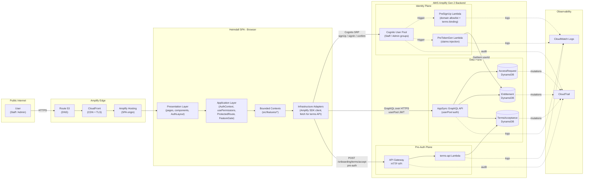
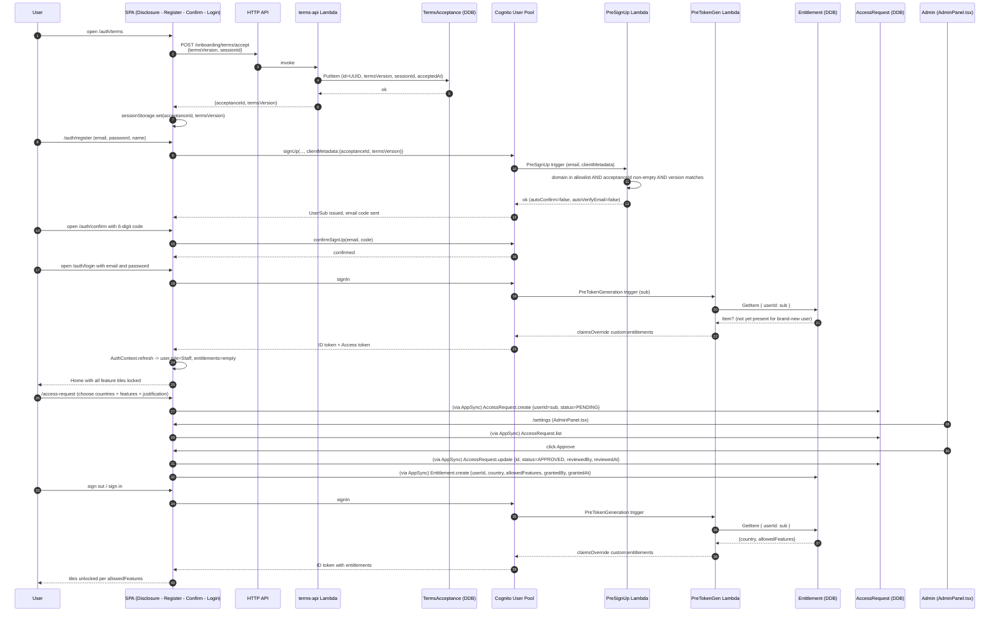
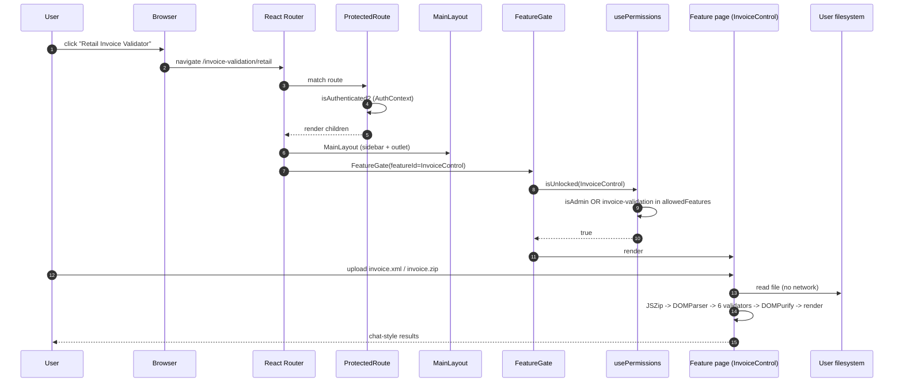
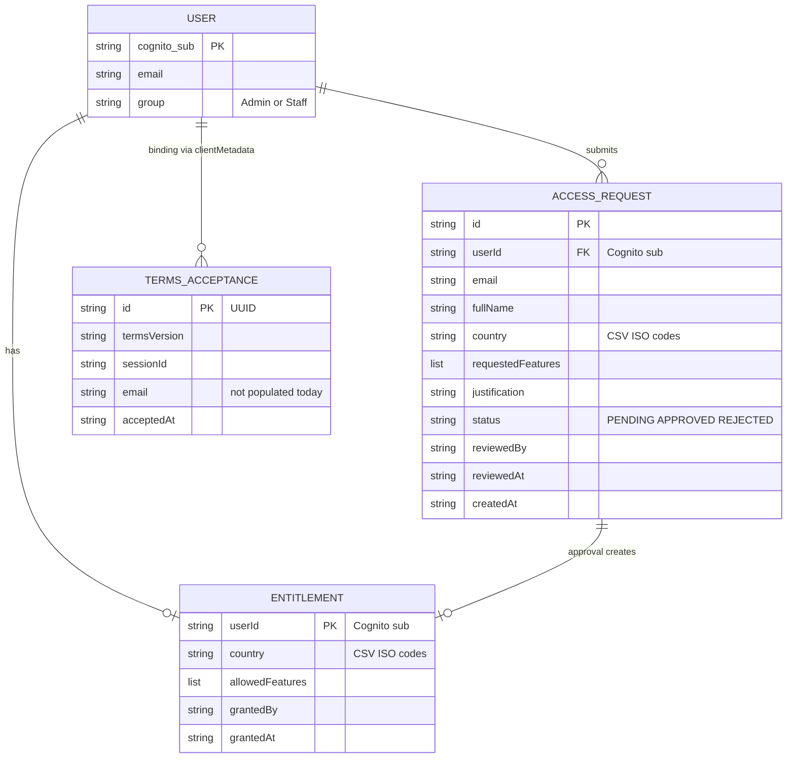
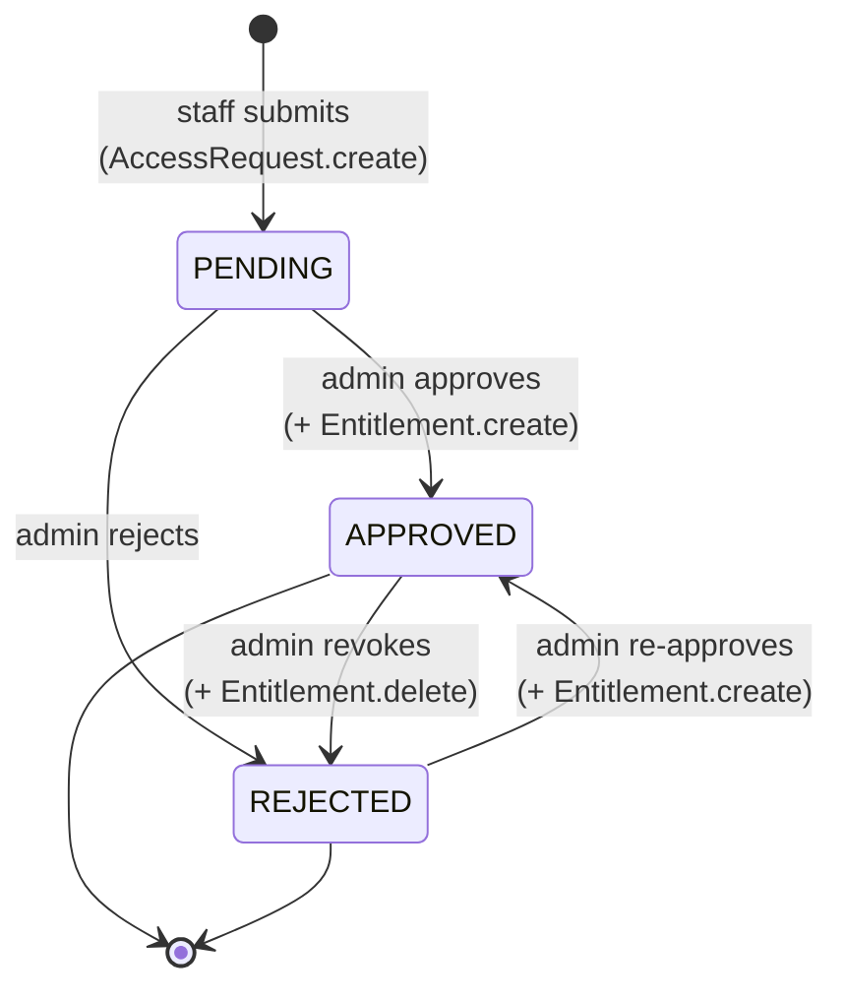

# Design Document: Architecture & User Journey Design

> Scope: a DDD-aligned architecture briefing for Heimdall that a
> leadership reviewer can read end-to-end in one sitting and a developer
> can use as a field guide to locate any failure in the request path. It
> combines a high-level "metro map" of the user journey with a
> low-level, reviewable view of the DynamoDB schema and the key
> algorithms (PreSignUp, PreTokenGeneration, Access-Request state
> machine). The document is the canonical reference the team will
> extend as Heimdall scales to additional markets.
>
> Every claim is sourced from a specific file in the repository; paths
> are cited inline so a reviewer can check the code against the prose.

## Overview

Heimdall is a client-heavy React 19 SPA hosted on AWS Amplify Hosting,
with a narrow AWS Amplify Gen 2 backend that owns identity, permission
state, and a single HTTP write endpoint for pre-auth terms acceptance.
Its domain model is organised around **two bounded contexts that live
in the backend** — *Identity & Entitlement* (who can use what) and
*Compliance* (terms of use acceptance) — and **six bounded contexts
that live in the frontend** under `src/features/*`, each of which is a
self-contained product capability (invoice parsing, invoice validation,
invoice conversion, payment reconciliation, CRTR extraction, and
authentication).

The story of a request through Heimdall is a journey across four
concentric trust boundaries: the public internet, the Amplify edge, the
authenticated SPA, and the Amplify backend. This document traces that
journey, then zooms into the data plane (the DynamoDB schema) and the
control plane (the Cognito triggers that translate stored entitlements
into ID-token claims). It is written so that an on-call engineer can
answer the question "where did this break?" by reading one diagram and
one table.

## Goals of this document

1. Give leadership a defensible picture of Heimdall's shape, trust
   boundaries, and observability posture.
2. Give engineers a precise "metro map" they can point at when
   triaging an incident.
3. Give reviewers a reviewable database schema, with access patterns
   and open improvement points, not a static artifact to rubber-stamp.
4. Make the design transferable: any team taking Heimdall to a new
   market should be able to re-use the same structure with market-
   specific plug-ins rather than a fork.

## Non-goals

- Not a product roadmap. Feature deliverables are tracked in
  `docs/06-risks-and-roadmap.md`.
- Not a security audit. Security posture is covered in
  `docs/03-security.md`; this document references it where relevant but
  does not duplicate it.
- Not a runbook. Operational procedures live in
  `docs/05-operations.md`.

---

## Part 1 — High-Level Design

### 1.1 Architecture at a glance

Heimdall has one SPA plane and two backend planes:

- **SPA plane** — the React bundle served by Amplify Hosting. Contains
  all the bounded contexts the user sees.
- **Identity / Data plane** — Cognito User Pool + AppSync GraphQL API
  + three DynamoDB tables. Used by the authenticated SPA.
- **Pre-auth plane** — one API Gateway HTTP API with one route
  (`POST /onboarding/terms/accept`) backed by a Lambda. This plane is
  intentionally unauthenticated because it fires *before* the user
  has a Cognito account (`amplify/backend.ts:50-65`).



A note on the sample diagram shared by the requester:

- The sample names the permission table `AccessGrants`. In the actual
  schema (`amplify/data/resource.ts:36-45`) the model is
  **`Entitlement`** with `userId` as its identifier. This document uses
  the real name throughout.
- The sample lists AWS WAF on the edge. **WAF is not provisioned** in
  `amplify/backend.ts`; edge protection today is whatever CloudFront
  gives Amplify Hosting by default. WAF is a documented future addition
  (`docs/06-risks-and-roadmap.md`).
- The sample says "Email OTP". Cognito here is configured as **email +
  password** (`amplify/auth/resource.ts:6`) with a 6-digit email
  verification code at sign-up, not passwordless OTP.
- The sample omits the `TermsAcceptance` table and its dedicated HTTP
  API. Both are on the critical path for a new user and are included
  below.

### 1.2 DDD mapping: bounded contexts and layers

Heimdall's structure follows DDD principles without being dogmatic
about it. The relevant decomposition:

| Bounded Context | Layer | Location | Responsibility |
|---|---|---|---|
| Authentication & Authorization | Application + Infrastructure | `src/features/authentication/` | Auth state, role resolution, entitlement guards, access-request submission, admin approval. |
| Compliance (Terms) | Application + Infrastructure | `DisclosurePage.tsx`, `amplify/functions/terms-api/` | Terms-of-use acceptance proof; binds acceptance to sign-up via `clientMetadata`. |
| Invoice Parsing | Domain + Presentation | `src/features/invoice-parsing/` | Parses UBL 2.1 XML into tabular form. |
| Invoice Validation | Domain + Presentation | `src/features/invoice-validation/{retail,dropship}` | Chat-style validators for AP and DF invoices. |
| Invoice Conversion | Domain + Presentation | `src/features/invoice-conversion/` | XSLT transform of signed UBL into an HTML preview. |
| Payment Reconciliation | Domain + Presentation | `src/features/payment-reconciliation/` | OFA remittance parser + dashboard. |
| CRTR Extraction | Domain + Presentation | `src/features/crtr-extraction/` | Consolidates many invoices into a CRTR-style summary. |

Cross-cutting layers:

- **Presentation** — pages under `src/App.tsx`, shared layout
  (`MainLayout`, `Sidebar`, `AuthLayout`), shared UI primitives under
  `src/shared/components/ui/`.
- **Application** — `AuthContext`, `useAuth`, `usePermissions`,
  `ProtectedRoute`, `FeatureGate`. These orchestrate domain contexts
  without knowing their internals.
- **Infrastructure adapters** — Amplify JS `generateClient<Schema>()`
  for AppSync, `fetch` for the terms API, Cognito SDK for
  `signUp` / `signIn` / `confirmSignUp` / `resetPassword`.
- **Backend domain** — defined in code under `amplify/` and pinned by
  the `Schema` type in `amplify/data/resource.ts`.

### 1.3 The user-journey metro map

The metro map is the single diagram a developer should look at when
asked "where did the failure happen?". Each stop is a point where a
request can succeed, fail, or be observed. Labels along the line
identify the file or resource that owns that stop.

```mermaid
flowchart LR
    A0[("User")]:::actor

    subgraph L1["Line A - Hosting path (every request)"]
        direction LR
        A1["Route 53<br/>DNS"]:::edge
        A2["CloudFront<br/>TLS + CDN"]:::edge
        A3["Amplify Hosting<br/>origin (SPA)"]:::edge
        A4["React bundle<br/>loaded, AuthContext<br/>hydrates"]:::spa
    end

    subgraph L2["Line B - Pre-auth compliance path"]
        direction LR
        B1["DisclosurePage.tsx<br/>user accepts terms"]:::spa
        B2["POST /onboarding/<br/>terms/accept"]:::api
        B3["terms-api Lambda"]:::fn
        B4[("TermsAcceptance<br/>PutItem")]:::db
        B5["sessionStorage:<br/>acceptanceId + version"]:::spa
    end

    subgraph L3["Line C - Authentication path"]
        direction LR
        C1["Register.tsx<br/>Cognito signUp"]:::spa
        C2["PreSignUp Lambda<br/>(domain + terms check)"]:::fn
        C3["Cognito User Pool<br/>sends email code"]:::id
        C4["ConfirmSignUp.tsx<br/>6-digit code"]:::spa
        C5["Login.tsx<br/>Cognito signIn"]:::spa
        C6["PreTokenGen Lambda<br/>reads Entitlement"]:::fn
        C7[("Entitlement<br/>GetItem userId")]:::db
        C8["Cognito issues<br/>ID + Access tokens"]:::id
        C9["AuthContext.refresh<br/>parses claims"]:::spa
    end

    subgraph L4["Line D - In-app feature path"]
        direction LR
        D1["ProtectedRoute<br/>src/features/authentication/<br/>guards"]:::spa
        D2["MainLayout + Sidebar"]:::spa
        D3["FeatureGate<br/>(isUnlocked featureId)"]:::spa
        D4["Feature page<br/>(src/features/*/components)"]:::spa
        D5["Browser-local processing<br/>(XML/XLSX/ZIP)"]:::spa
    end

    subgraph L5["Line E - Access-request path"]
        direction LR
        E1["AccessRequest.tsx<br/>form submit"]:::spa
        E2["AppSync<br/>AccessRequest.create"]:::api
        E3[("AccessRequest<br/>PutItem,<br/>status=PENDING")]:::db
        E4["AdminPanel.tsx<br/>list + review"]:::spa
        E5["AppSync AccessRequest.update<br/>+ Entitlement.create"]:::api
        E6[("AccessRequest,<br/>Entitlement<br/>tables updated")]:::db
        E7["User signs out / in;<br/>PreTokenGen picks up<br/>new entitlement"]:::fn
    end

    A0 --> A1 --> A2 --> A3 --> A4
    A4 --> B1 --> B2 --> B3 --> B4
    B3 --> B5 --> C1 --> C2 --> C3 --> C4 --> C5
    C5 --> C6 --> C7 --> C8 --> C9
    C9 --> D1 --> D2 --> D3 --> D4 --> D5
    C9 --> E1 --> E2 --> E3
    E3 --> E4 --> E5 --> E6 --> E7 --> C6

    classDef actor fill:#fff3bf,stroke:#8c7a00,color:#3d3200
    classDef edge  fill:#e7f5ff,stroke:#1c7ed6,color:#0b3d73
    classDef spa   fill:#f3f0ff,stroke:#7048e8,color:#2c1e72
    classDef api   fill:#fff0f6,stroke:#d6336c,color:#5a0a2d
    classDef fn    fill:#fff4e6,stroke:#e8590c,color:#5a2700
    classDef id    fill:#e6fcf5,stroke:#0ca678,color:#0a4f3c
    classDef db    fill:#f1f3f5,stroke:#495057,color:#212529
```



**How to read the map.** Each "line" is a causal chain. A single user
action may ride two lines in sequence (for example a new user rides
Line A → Line B → Line C before even seeing a feature). Each node is
labeled with the file or AWS resource that owns it so you can search
the repo directly. Observability handoffs for every node are
summarised in §1.5.

### 1.4 Key request flows

#### Flow 1 — A new user registers and gets approved



#### Flow 2 — An authorized user opens a feature



Nothing from this flow leaves the browser. The observability
implication is important: problems on Line D cannot be inspected from
CloudWatch. They require browser devtools or a client-side error
telemetry stack (not yet built — see §1.5).

### 1.5 Observability handoffs — the failure-location matrix

This table is the "where did it break?" checklist. Each row is a node
from the metro map, with the logs/metrics where evidence would appear,
and the owning file.

| Metro-map node | Owner | What gets logged / measured | Where to look |
|---|---|---|---|
| Route 53 DNS | AWS | Resolution metrics, DNS query logs (if enabled) | Route 53 console; not wired to CloudWatch by default. |
| CloudFront | Amplify Hosting | Edge access logs (optional), cache metrics | Amplify Hosting access logs (disabled today). |
| Amplify Hosting origin | Amplify Hosting | Build logs, deploy status | Amplify console → `main` branch. |
| React bundle load | Browser | Console errors; no server-side signal | Browser DevTools; **no client-side telemetry configured**. |
| `DisclosurePage.tsx` | SPA | `console.warn` on fallback path (dev only, line 408-423) | DevTools. |
| `POST /onboarding/terms/accept` | API Gateway | Access log (if enabled), 4xx/5xx count | API Gateway metrics; access log **not configured**. |
| `terms-api` Lambda | Lambda | `console.error` on DDB failure (`handler.ts:72`) | CloudWatch Logs (`/aws/lambda/terms-api`). |
| `TermsAcceptance` PutItem | DynamoDB | Mutations via CloudTrail data events (if enabled) | CloudTrail; default off. |
| Cognito `signUp` | Cognito | Cognito user event log, SMS/email delivery | Cognito console; CloudTrail management events. |
| `PreSignUp` Lambda | Lambda | Exception message passed back to client as-is | CloudWatch Logs (`/aws/lambda/preSignUp-...`). |
| Email code delivery | Cognito | Delivery failure in Cognito console | Cognito console → Users tab. |
| Cognito `signIn` | Cognito | Cognito user events | Cognito console; CloudTrail. |
| `PreTokenGen` Lambda | Lambda | `console.log` on match, `console.error` on DDB failure (`handler.ts:51, 96`) | CloudWatch Logs (`/aws/lambda/preTokenGeneration-...`). |
| `Entitlement` GetItem | DynamoDB | Consumed RCUs, throttled reads | CloudWatch DDB metrics. |
| `AuthContext.refresh()` | SPA | No logs; silent catch swallows errors (`AuthContext.tsx:108`) | DevTools only. **Improvement**: log to telemetry. |
| `ProtectedRoute` / `FeatureGate` | SPA | No logs | DevTools; inspect `user`, `entitlements`, `isUnlocked` via React DevTools. |
| `AccessRequest.create` (AppSync) | AppSync | CloudWatch AppSync logs (opt-in), request history | AppSync console → monitoring (not enabled today). |
| `AdminPanel.tsx` mutations | SPA | `console.error` on failed approve/reject/revoke | DevTools. |
| In-feature processing (XML/XLSX) | SPA | `console.error`; UI toasts via `react-toastify` | DevTools. |

**Improvements leadership should know about:**

1. **No correlation ID spans the boundary.** The same logical request
   cannot be followed across SPA → API GW → Lambda → DDB. Adding a
   `x-heimdall-request-id` header generated in the client and logged in
   every handler would close this gap in one pass.
2. **No client-side error telemetry.** React errors, network failures,
   and silent catches (e.g. `AuthContext.refresh`) are invisible to
   the team. CloudWatch RUM or an equivalent is the fastest remedy.
3. **No log retention set in IaC.** Default CloudWatch retention is
   "never expire"; costs creep in silently.
4. **No alarms.** Lambda error rate, DDB throttles, and HTTP API 5xx
   rate all have zero alerting configured.

### 1.6 Components and interfaces (by bounded context)

Below are the interfaces a new engineer needs to know in order to wire
a new feature into Heimdall. Full source is in the cited files.

#### Identity & Authorization

```typescript
// src/features/authentication/context/AuthContext.tsx (§ exports)
export type Role = "Admin" | "Staff";

export type Entitlements = {
  country: string;               // comma-separated ISO codes, e.g. "TR,DE"
  allowedFeatures: string[];     // e.g. ["invoice-parsing","crtr-extraction"]
};

export type AuthUser = {
  userId: string;   // Cognito sub — the PK used in Entitlement
  email: string;
  name: string;
  role: Role;
};

export type AuthContextValue = {
  isAuthenticated: boolean;
  user: AuthUser | null;
  entitlements: Entitlements | null;
  loading: boolean;
  refresh: () => Promise<void>;
  signOut: () => Promise<void>;
};
```

```typescript
// src/features/authentication/hooks/usePermissions.ts
export type FeatureKey =
  | "Home" | "AccessRequest"
  | "InvoiceParsing" | "InvoiceControl" | "InvoiceVerify"
  | "InvoiceValidateDF" | "Recon" | "CRTRExtraction"
  | "Settings" | "Help" | "Logout";

export function usePermissions(): {
  isAdmin: boolean;
  allowedFeatures: string[];
  isUnlocked: (id: FeatureKey) => boolean;
};
```

**Responsibilities.**

- `AuthContext` owns the single source of truth for identity in the
  SPA. All components consume via `useAuth()`.
- `usePermissions` translates the feature-key namespace (`"InvoiceControl"`)
  into the entitlement-key namespace (`"invoice-validation"`). This is the
  only place the mapping exists, so it is easy to extend when a new
  feature arrives.

#### Compliance (Terms)

```typescript
// amplify/functions/terms-api/handler.ts — POST /onboarding/terms/accept
interface AcceptTermsRequest { termsVersion: string; sessionId: string }
interface AcceptTermsResponse { acceptanceId: string; termsVersion: string }
```

```typescript
// amplify/auth/pre-sign-up/handler.ts — Cognito trigger contract
interface PreSignUpInput {
  email: string;                       // userAttributes.email
  clientMetadata: {
    acceptanceId: string;              // from terms-api
    termsVersion: string;              // must equal CURRENT_TERMS_VERSION
  };
}
// Throws on failure; Cognito surfaces the message to the SPA.
```

#### Identity trigger: PreTokenGeneration

```typescript
// amplify/auth/pre-token-generation/handler.ts
interface PreTokenGenInput { sub: string /* Cognito user id */ }
interface PreTokenGenOutput {
  claimsOverrideDetails: {
    claimsToAddOrOverride: {
      "custom:entitlements": string;    // JSON.stringify({country, allowedFeatures})
    };
  };
}
```

#### Access-request domain model

```typescript
// amplify/data/resource.ts — AppSync + DynamoDB
interface AccessRequest {
  id: string;                                 // default PK
  userId: string;                             // Cognito sub
  email: string;
  fullName: string;
  country: string;                            // comma-separated ISO codes
  requestedFeatures: string[];
  justification?: string;
  status: "PENDING" | "APPROVED" | "REJECTED";
  reviewedBy?: string;
  reviewedAt?: string;
  createdAt: string;                          // Amplify-managed
}

interface Entitlement {
  userId: string;                             // PK (Cognito sub)
  country: string;
  allowedFeatures: string[];
  grantedBy: string;
  grantedAt: string;
}

interface TermsAcceptance {
  id: string;                                 // default PK (UUID)
  termsVersion: string;
  sessionId?: string;
  email?: string;                             // not populated today
  acceptedAt: string;
}
```

### 1.7 Trust boundaries

| Boundary | Traffic | Authn | AuthZ | Transport |
|---|---|---|---|---|
| Internet → Edge | All HTTP | — | — | TLS 1.2+ |
| SPA → Cognito | SRP (signUp, signIn, confirm, reset) | Cognito SRP | Password + email | TLS |
| SPA → AppSync | GraphQL CRUD | `userPool` JWT | Per-model rules (`allow.owner`, `allow.group("Admin")`) | TLS |
| SPA → HTTP API | Terms accept only | **None (pre-auth)** | Origin allowlist + body schema + version check | TLS |
| Lambda → DDB | Reads/writes on Entitlement, AccessRequest, TermsAcceptance | IAM role | Per-table resource ARN (terms-api); `Resource:"*"` (PreTokenGen — see §3.1) | AWS SigV4 |
| Lambda ↔ Cognito triggers | Invoked by Cognito | Service-to-service | — | AWS-internal |

The pre-auth plane is the only component that accepts unauthenticated
writes. It mitigates the risk by (a) CORS origin allowlist,
(b) mandatory `termsVersion` match, and (c) a conditional PutItem that
refuses duplicate IDs. See `docs/03-security.md` for the open gap on
verifying `acceptanceId` existence inside `preSignUp`.

### 1.8 Scaling to other markets

The design is structured so a new market can be onboarded as a
configuration exercise rather than a fork:

- **Country list** — add ISO codes to `COUNTRIES` in `AccessRequest.tsx`
  (client-side form) and let the existing comma-separated `country`
  attribute hold the new value. No schema change required.
- **Feature list** — add a `FeatureKey` to `usePermissions.ts`, a sidebar
  entry, a route + `FeatureGate`, and the feature module under
  `src/features/<new-feature>/`.
- **Region-specific processors** — the payment-reconciliation module
  already has a placeholder registry at
  `src/features/payment-reconciliation/config/regions/` designed for
  market plug-ins. Bringing a second market online means adding a new
  processor implementation, not altering the application layer.
- **Identity** — a new market with its own corporate email domain
  just needs that domain added to `ALLOWED_DOMAINS` in
  `amplify/auth/pre-sign-up/handler.ts`.
- **Legal / compliance** — a new market gets a new
  `CURRENT_TERMS_VERSION` string; the acceptance path is generic.

The two things that would change with a genuinely multi-region
deployment are (a) CloudFront geographic replication policy, and
(b) DynamoDB Global Tables on `Entitlement` and `AccessRequest` if the
SPA is served from multiple regions. Neither requires schema change.

---

## Part 2 — Low-Level Design

### 2.1 Database schema (current state, reviewable)

Heimdall has **three tables** managed by Amplify Gen 2 via
`amplify/data/resource.ts` and **they are all the persistent state the
system has**. Any redesign leadership may want to authorise starts
from this section.

#### 2.1.1 `AccessRequest`

```text
Table           : AccessRequest (Amplify-generated name)
Partition key   : id               (String, default UUID)
Sort key        : —
GSIs            : (Amplify auto-creates) owner-based index on `owner`
Auth (AppSync)  : allow.owner().to(["create","read"])
                  allow.group("Admin")  (full CRUD)
Billing         : on-demand
PITR            : default (off)
```

Attributes:

| Attribute | Type | Required | Notes |
|---|---|---|---|
| `id` | String | yes | Default Amplify-generated UUID. |
| `owner` | String | auto | Amplify-injected `cognito:username` for `allow.owner`. |
| `userId` | String | yes | Cognito `sub`. Used to write Entitlement on approval so PK matches `preTokenGeneration` lookup (`AdminPanel.tsx:96`). |
| `email` | String | yes | Submitter email (cached for admin UI). |
| `fullName` | String | yes | Cached display name. |
| `country` | String | yes | Comma-separated ISO-3166-1 alpha-2 codes, e.g. `"TR,DE"`. |
| `requestedFeatures` | List<String> | yes | Feature keys, e.g. `["invoice-parsing"]`. |
| `justification` | String | no | Free text, ≥10 chars enforced client-side. |
| `status` | Enum | no | `PENDING` \| `APPROVED` \| `REJECTED` (default `PENDING`). |
| `reviewedBy` | String | no | Admin email. |
| `reviewedAt` | String | no | ISO-8601 timestamp. |
| `createdAt` | String | auto | Amplify-managed. |
| `updatedAt` | String | auto | Amplify-managed. |

Access patterns supported today:

| Pattern | Implemented by | Performance |
|---|---|---|
| Owner reads their own requests | `allow.owner` (implicit GSI on `owner`) | O(1) index lookup per owner. |
| Admin lists all requests | `AccessRequest.list` from AppSync | **Full Scan** — acceptable at current scale; flagged in §2.1.4. |
| Admin filters by status | Client-side filter after Scan | Adequate today; will not scale. |

#### 2.1.2 `Entitlement`

```text
Table           : Entitlement (Amplify-generated name)
Partition key   : userId           (String, Cognito sub)
Sort key        : —
GSIs            : none
Auth (AppSync)  : allow.group("Admin")                 (full CRUD)
External reader : PreTokenGen Lambda via DDB SDK       (GetItem by userId)
Billing         : on-demand
PITR            : default (off) — recommended ON in §3.2
```

Attributes:

| Attribute | Type | Required | Notes |
|---|---|---|---|
| `userId` | String | yes | **PK; must equal Cognito `sub`** or `PreTokenGen` will not find it. |
| `country` | String | yes | Comma-separated ISO codes. |
| `allowedFeatures` | List<String> | yes | Feature keys. Mirrored into `custom:entitlements` claim. |
| `grantedBy` | String | yes | Admin email who approved. |
| `grantedAt` | String | yes | ISO-8601. |
| `createdAt` / `updatedAt` | String | auto | Amplify-managed. |

Access patterns:

| Pattern | Implemented by | Performance |
|---|---|---|
| PreTokenGen reads entitlement by userId | `GetItem` with IAM role | O(1). |
| Admin reads any entitlement | AppSync model CRUD | O(1) per id. |
| Admin revokes access | `Entitlement.delete({userId})` (`AdminPanel.tsx:170`) | O(1). |

**Design note.** `userId` is declared as the identifier via
`.identifier(["userId"])` in `amplify/data/resource.ts:44`, which means
Amplify skips the default `id` field and uses `userId` as the PK
directly. This is the right shape for the lookup pattern.

#### 2.1.3 `TermsAcceptance`

```text
Table           : TermsAcceptance (Amplify-generated name)
Partition key   : id               (String, UUID)
Sort key        : —
GSIs            : none
Auth (AppSync)  : allow.group("Admin")                 (read)
External writer : terms-api Lambda via DDB SDK         (PutItem with ConditionExpression)
Billing         : on-demand
```

Attributes:

| Attribute | Type | Required | Notes |
|---|---|---|---|
| `id` | String | yes (default) | `randomUUID()` from the Lambda. |
| `termsVersion` | String | yes | Must match `CURRENT_TERMS_VERSION` env var. |
| `sessionId` | String | no | Client-generated; used to correlate with browser session. |
| `email` | String | no | **Not populated today** — Lambda does not receive email yet. See §3.2. |
| `acceptedAt` | String | yes | Server-side ISO-8601. |

Access patterns:

| Pattern | Implemented | Performance |
|---|---|---|
| Write on terms accept | `PutItem` with `attribute_not_exists(id)` | O(1). |
| Read (audit) | Admin via AppSync `list` | Full Scan; audit-only, low frequency. |

#### 2.1.4 Relationships



The "binding" between `USER` and `TERMS_ACCEPTANCE` is intentionally
weak because the acceptance is recorded before the user exists. The
field that represents the binding is `acceptanceId` passed through
`clientMetadata` on `signUp` — see §3.2 for the improvement.

#### 2.1.5 Open schema-review items

1. **`AccessRequest.status` should be indexed.** Today, `AdminPanel`
   fetches all rows and filters client-side. Adding a GSI on `status`
   (and `createdAt` as sort key) would turn this into an O(pending)
   query as volumes grow.

   ```text
   GSI: byStatus
     PK: status
     SK: createdAt (DESC)
   ```

2. **`Entitlement` has no audit history.** When an admin revokes and
   re-grants, the previous state is gone. Two options: (a) add an
   `EntitlementHistory` table appended on every write, or (b) flip to
   a single-table design keyed by `(userId, grantedAt)` and mark the
   current row with a flag.

3. **`TermsAcceptance.id` → `acceptanceId` is opaque.** To close the
   security gap in §3.2 we need `preSignUp` to `GetItem` by
   `acceptanceId`. Adding `email` at sign-up time (as a second write
   inside `preSignUp`) would give us a durable user↔acceptance link.

4. **`country` stored as comma-separated string.** Works today but is
   hostile to filtering. A `countries: string[]` attribute would let
   Amplify index individual codes if we later need "who has TR
   access?".

5. **No PITR.** None of the three tables have point-in-time recovery
   enabled. The blast radius of an admin-panel mistake is unbounded.
   Enabling PITR is a line-of-code change via CDK.

6. **No TTL on `AccessRequest` or `TermsAcceptance`.** Rejected
   requests and stale acceptances linger forever. A TTL attribute on
   rejected rows (e.g. 180 days) would keep the table clean.

### 2.2 Key Functions with Formal Specifications

#### 2.2.1 `preSignUp` — domain allowlist + terms binding

```typescript
// amplify/auth/pre-sign-up/handler.ts
async function preSignUp(event: PreSignUpTriggerEvent): Promise<PreSignUpTriggerEvent>
```

**Preconditions.**
- `event.request.userAttributes.email` is a string.
- `event.request.clientMetadata` may be `undefined`.
- `process.env.CURRENT_TERMS_VERSION` is set.

**Postconditions.**
- Returns `event` unchanged **iff** all three checks pass:
  1. `email` is non-empty, parses to a domain, and domain ∈
     `ALLOWED_DOMAINS`.
  2. `clientMetadata.acceptanceId` is non-empty after trim.
  3. `clientMetadata.termsVersion` equals `CURRENT_TERMS_VERSION`.
- `event.response.autoConfirmUser === false` and
  `event.response.autoVerifyEmail === false`.
- Otherwise, throws an `Error` whose message Cognito surfaces to the
  SPA. The user is not created.

**Loop invariants.** N/A (straight-line function).

**Observability.** No structured logs today. The thrown error message
is the only artifact the user sees. Improvement tracked in §3.2.

#### 2.2.2 `preTokenGeneration` — entitlement → claim injection

```typescript
// amplify/auth/pre-token-generation/handler.ts
async function preTokenGeneration(
  event: PreTokenGenerationTriggerEvent
): Promise<PreTokenGenerationTriggerEvent>
```

**Preconditions.**
- Lambda role has `dynamodb:GetItem`, `dynamodb:ListTables` on the
  target account (`backend.ts:36-47`).
- `event.request.userAttributes.sub` is the Cognito user id.

**Postconditions.**
- `event.response.claimsOverrideDetails.claimsToAddOrOverride
  ["custom:entitlements"]` is always set.
- If the Entitlement table is discoverable **and** contains an item for
  `userId === sub`, the claim reflects the stored `{country,
  allowedFeatures}`.
- If the table is not discoverable **or** the item is missing, the
  claim falls back to the legacy `custom:entitlements` user attribute
  (if any) or to `{country:"",allowedFeatures:[]}`.
- Returns `event` without throwing (a thrown exception would block
  sign-in — intentionally avoided).

**Loop invariants (table discovery).**
- After each `ListTables` page, `cachedTableName` is either still
  `null` **or** holds a table name that satisfies
  `includes("Entitlement") && !includes("AccessRequest")`.
- `lastTable` strictly advances (`LastEvaluatedTableName`) so the
  loop terminates after at most O(tables / 100) iterations.

**Failure modes.**
- `ListTables` IAM denial → table not discovered → fallback claim.
- `GetItem` throws → caught, logged, fallback claim.
- Table rename → cache invalidated on cold-start; stale cache for the
  life of one Lambda container.

#### 2.2.3 `terms-api` — POST /onboarding/terms/accept

```typescript
// amplify/functions/terms-api/handler.ts
async function handler(event: APIGatewayProxyEventV2)
  : Promise<APIGatewayProxyResultV2>
```

**Preconditions.**
- `process.env.TERMS_TABLE_NAME` is set.
- `process.env.CURRENT_TERMS_VERSION` is set.
- `process.env.ALLOWED_ORIGIN` is set to an exact origin (no wildcard).

**Postconditions.**
- Returns HTTP 200 `{acceptanceId, termsVersion}` **iff**:
  1. Body parses to JSON.
  2. `termsVersion` is non-empty and equals `CURRENT_TERMS_VERSION`.
  3. `sessionId` is non-empty.
  4. `PutItem` with `ConditionExpression: attribute_not_exists(id)`
     succeeds.
- Returns 4xx otherwise; returns 500 on DDB failure.
- Response headers: `access-control-allow-origin` is echoed **only if**
  the request `Origin` equals `ALLOWED_ORIGIN`. `Vary: Origin` is always
  set. No wildcard.

**Idempotency.** The UUID used for `id` is fresh on every invocation.
The conditional PutItem protects against the (vanishingly unlikely)
UUID collision case only. Two identical requests from the same browser
create two rows. Callers are responsible for not retrying blindly.

#### 2.2.4 Access-request state machine (admin approval)

```typescript
// src/features/authentication/components/AdminPanel.tsx
async function handleApprove(req: AccessRequestItem): Promise<void>
```

**Preconditions.**
- `user.role === "Admin"` (enforced by `FeatureGate("Settings")` and
  AppSync `allow.group("Admin")`).
- `req.id` is a valid `AccessRequest` id.
- `req.userId` equals the applicant's Cognito `sub` (invariant set in
  `AccessRequest.tsx:72`).

**Postconditions.**
- `AccessRequest[req.id]` has `status="APPROVED"`, `reviewedBy=admin`,
  `reviewedAt=now`.
- `Entitlement[req.userId]` exists with `country` and `allowedFeatures`
  copied from the request and `grantedBy=admin`, `grantedAt=now`.
- Local `requests` state in the admin panel reflects the new status.

**Failure modes (documented, today).**
- If the `AccessRequest.update` succeeds but `Entitlement.create`
  throws, the system is left in a **partial state** (request says
  APPROVED but there is no Entitlement row). The UI logs the error and
  surfaces a message but **does not roll back**. This is a known
  design weakness that leadership should be aware of.
- **Suggested improvement**: wrap both writes in an AppSync pipeline
  resolver or a Lambda that uses a DynamoDB `TransactWriteItems`
  across the two tables (both are owned by the same account and
  region, so a transaction is legal).

### 2.3 Algorithmic pseudocode

#### Algorithm A — `PreTokenGeneration` claims computation

```pascal
ALGORITHM computeEntitlementsClaim(event)
INPUT:  event (Cognito PreTokenGeneration trigger event)
OUTPUT: event with custom:entitlements claim set

BEGIN
  userId     <- event.request.userAttributes.sub
  tableName  <- discoverEntitlementTable()        // cached per container
  ent        <- { country: "", allowedFeatures: [] }

  IF tableName != NULL AND userId != "" THEN
    TRY
      item <- DDB.GetItem(tableName, { userId })
      IF item != NULL THEN
        ent.country         <- item.country OR ""
        ent.allowedFeatures <- item.allowedFeatures OR []
      END IF
    CATCH err
      LOG.error("DynamoDB read failed", err)
      // ent remains empty — fail-open to empty entitlements
    END TRY
  END IF

  IF ent.country = "" AND ent.allowedFeatures.length = 0 THEN
    // Legacy fallback: inline custom:entitlements on the user
    raw <- event.request.userAttributes["custom:entitlements"]
    IF raw is non-empty string THEN
      TRY
        parsed <- JSON.parse(raw)
        ent.country         <- parsed.country OR ""
        ent.allowedFeatures <- parsed.allowedFeatures OR []
      CATCH _ignored
      END TRY
    END IF
  END IF

  event.response.claimsOverrideDetails.claimsToAddOrOverride
      ["custom:entitlements"] <- JSON.stringify(ent)

  RETURN event
END
```

**Loop invariant (inside `discoverEntitlementTable`).** On each
iteration, either `cachedTableName` is the discovered table and the
loop exits, or `lastTable` strictly advances toward the end of the
table list.

**Fail-open rationale.** A user who was already able to sign in should
not be locked out by a transient DDB error. The rest of the system
already denies access by default when `allowedFeatures` is empty, so
fail-open here is safe.

#### Algorithm B — AccessRequest → Entitlement approval (today vs. recommended)

Today's flow (`AdminPanel.tsx:handleApprove`):

```pascal
ALGORITHM approveRequest_current(req, admin)
BEGIN
  AppSync.AccessRequest.update({ id: req.id,
                                 status: "APPROVED",
                                 reviewedBy: admin.email,
                                 reviewedAt: now() })
  AppSync.Entitlement.create({ userId: req.userId,
                               country: req.country,
                               allowedFeatures: req.requestedFeatures,
                               grantedBy: admin.email,
                               grantedAt: now() })
  // NON-TRANSACTIONAL: if step 2 fails, step 1 stays.
END
```

Recommended flow:

```pascal
ALGORITHM approveRequest_recommended(req, admin)
BEGIN
  DDB.TransactWriteItems([
    { Update: AccessRequestTable, Key:{id:req.id},
      Set: { status: "APPROVED",
             reviewedBy: admin.email,
             reviewedAt: now() },
      ConditionExpression: "status = :pending" },
    { Put: EntitlementTable,
      Item: { userId: req.userId,
              country: req.country,
              allowedFeatures: req.requestedFeatures,
              grantedBy: admin.email,
              grantedAt: now() },
      ConditionExpression: "attribute_not_exists(userId) OR grantedAt < :now" }
  ])
  // All-or-nothing: either both happen or neither does.
END
```

Moving to `TransactWriteItems` requires a custom AppSync resolver or a
Lambda-backed mutation, both of which are supported by Amplify Gen 2
without leaving the IaC model.

#### Algorithm C — Access-request state machine



Transition invariants the system must preserve:

- `status="APPROVED"` ⇔ there exists an `Entitlement` row with
  `userId=req.userId`.
- `status="REJECTED"` ⇒ no `Entitlement` row for that userId.
- A single user may have multiple request rows over time but **at most
  one Entitlement row at a time** (because `userId` is the PK).

These invariants are the ones a TransactWriteItems rewrite should
enforce at the data layer.

### 2.4 Example usage

```typescript
// Example 1 — Signing up with binding to a fresh terms acceptance
//             (src/features/authentication/components/Register.tsx)
const acceptanceId = sessionStorage.getItem("heimdall.acceptanceId") ?? "";
const termsVersion = sessionStorage.getItem("heimdall.termsVersion") ?? "";

await signUp({
  username: email,
  password,
  options: {
    userAttributes: { email, given_name, family_name, name: fullName },
    clientMetadata: { acceptanceId, termsVersion },
    autoSignIn: false,
  },
});
```

```typescript
// Example 2 — Guarding a route with the entitlement claim
//             (src/App.tsx + FeatureGate.tsx + usePermissions.ts)
<Route
  path="crtr-extraction"
  element={
    <FeatureGate featureId="CRTRExtraction">
      <CRTRExtraction />
    </FeatureGate>
  }
/>

// FeatureGate calls usePermissions().isUnlocked("CRTRExtraction")
// which resolves to isAdmin OR entitlements.allowedFeatures
//   .includes("crtr-extraction")
```

```typescript
// Example 3 — Admin approves an access request
//             (src/features/authentication/components/AdminPanel.tsx)
await client.models.AccessRequest.update({
  id: req.id,
  status: "APPROVED",
  reviewedBy: user.email,
  reviewedAt: new Date().toISOString(),
});
await client.models.Entitlement.create({
  userId: req.userId,
  country: req.country,
  allowedFeatures: req.requestedFeatures,
  grantedBy: user.email,
  grantedAt: new Date().toISOString(),
});
// Staff must sign out + sign in to pick up the new claim.
```

### 2.5 Correctness properties

These are the invariants the system assumes, stated so a reviewer can
check each against code or tests. They are candidates for
property-based tests if/when a test suite lands.

- **P1 — Claim ⇔ Entitlement.** For every user `u`, the value of
  `custom:entitlements` in the *next* ID token issued by Cognito is
  exactly `JSON.stringify(Entitlement[u.sub])` if the row exists, and
  `{country:"",allowedFeatures:[]}` otherwise. (`preTokenGeneration`.)
- **P2 — Identity of the PK.** For any `AccessRequest` row with
  `status = "APPROVED"`, the `userId` attribute equals the Cognito
  `sub` of the requester, so `Entitlement[userId]` is guaranteed to be
  readable by `preTokenGeneration`.
- **P3 — Terms version monotonic gate.** `preSignUp` rejects any sign-up
  whose `clientMetadata.termsVersion` does not equal
  `CURRENT_TERMS_VERSION`. Bumping the version therefore forces
  everyone to re-accept.
- **P4 — Domain allowlist.** For every created Cognito user, the email
  domain is in `ALLOWED_DOMAINS` at sign-up time.
- **P5 — Per-model authZ.** AppSync denies (a) any non-owner, non-Admin
  read/write of `AccessRequest`; (b) any non-Admin read of
  `Entitlement` or `TermsAcceptance`.
- **P6 — Origin echo safety.** `terms-api` never echoes a wildcard as
  `access-control-allow-origin`; it echoes the request origin only
  when that origin equals `ALLOWED_ORIGIN`.
- **P7 — At most one active entitlement per user.** The `Entitlement`
  PK is `userId`, so a create is a natural upsert; revoke deletes it
  entirely. (This is the invariant §2.3 Algorithm B strengthens.)

### 2.6 Error handling

| Scenario | Detected by | Response | Recovery |
|---|---|---|---|
| Email domain not allowed | `preSignUp` | Throws; SPA shows error | User uses a corporate email |
| Terms version mismatch | `preSignUp` | Throws "Terms version mismatch" | SPA forces re-acceptance path |
| Cognito 6-digit code expired | Cognito | Returns `CodeMismatchException` | `ConfirmSignUp.tsx` offers `resendSignUpCode` |
| Entitlement table not found | `preTokenGeneration` | Logs warning, falls back to empty claim | Set `ENTITLEMENT_TABLE_NAME` env var |
| DDB GetItem throttled | `preTokenGeneration` | Logs error, falls back to empty claim | Retry on next sign-in; enable DDB adaptive capacity |
| terms-api DDB write fails | `terms-api` | HTTP 500 with CORS-aware response | SPA (production) shows "unavailable"; (dev) uses local fallback id |
| Admin approval partial failure | `AdminPanel.tsx` | `console.error`, UI error banner | Admin retries or manually fixes via console — §2.2.4 recommends a fix |
| AppSync model auth denied | AppSync | GraphQL error | Caller displays "not authorized" |
| SPA token expired | Amplify SDK | Auto-refresh; on failure, SPA redirects to `/auth/login` | User signs in again |

### 2.7 Testing strategy

Heimdall currently has no automated test suite. What a first pass
should cover, in priority order:

#### Unit

- `usePermissions.isUnlocked` for Admin, Staff with empty / partial /
  full `allowedFeatures`, and the special case `Settings`.
- `parseGroups` and `parseEntitlements` in `AuthContext.tsx` for
  malformed inputs (null, non-JSON string, partial object).
- `terms-api` body validation path for every 4xx branch.

#### Property-based (candidate library: `fast-check`)

- **P1** claim equality: for arbitrary `Entitlement` inputs, the
  serialized claim round-trips through `parseEntitlements` to the same
  shape.
- **P4** domain allowlist: for arbitrary emails with domains in and
  out of the allowlist, `preSignUp` accepts iff the domain is a member.
- **P6** CORS echo safety: for arbitrary request `Origin` headers,
  `terms-api` never returns an `access-control-allow-origin` of `*`
  and never echoes an origin different from `ALLOWED_ORIGIN`.

#### Integration (end-to-end, Amplify sandbox)

- Full new-user flow: accept terms → sign up → confirm → sign in →
  empty entitlements → submit access request → admin approves →
  re-sign-in → entitlements reflected in claim → feature unlocked.
- Admin revoke: approved user signs in, admin revokes, user re-signs,
  feature locked again.

---

## Part 3 — Open items the reviewer should weigh in on

### 3.1 IAM scoping for `preTokenGeneration`

Current policy (`amplify/backend.ts:36-47`):

```typescript
Actions:   dynamodb:GetItem, Query, Scan, ListTables, DescribeTable
Resources: "*"
```

This is broader than needed. In production it should be narrowed to
the Entitlement table ARN, and `Scan` / `DescribeTable` / `Query` can
be dropped. Keeping `ListTables` is optional depending on whether we
retain the dynamic-discovery path (§2.2.2) or pin the table name via
env var in all environments.

### 3.2 Closing the terms-binding gap

Today `preSignUp` only checks that `acceptanceId` is non-empty and that
`termsVersion` matches. It does not verify the acceptance row exists.
Proposed fix:

```pascal
ALGORITHM preSignUpWithBinding(event)
BEGIN
  ... existing domain checks ...

  acceptance <- DDB.GetItem(TermsAcceptanceTable, { id: acceptanceId })
  IF acceptance = NULL THEN
    THROW "Terms acceptance not found"
  END IF
  IF acceptance.termsVersion != CURRENT_TERMS_VERSION THEN
    THROW "Terms version mismatch"
  END IF

  DDB.UpdateItem(TermsAcceptanceTable, { id: acceptanceId },
                 Set: { email: event.request.userAttributes.email,
                        boundAt: now() })
  RETURN event
END
```

This turns the acceptance row from "orphan evidence" into a durable
link.

### 3.3 Transactional approval

Adopt `DDB.TransactWriteItems` for admin approval (§2.3 Algorithm B)
to eliminate the partial-state window.

### 3.4 Client-side observability

Even a minimal React error boundary + a `fetch` wrapper that emits
`x-heimdall-request-id` would change the "where did it break?" story
materially. Recommended before onboarding a second market.

### 3.5 Table design — GSIs and PITR

Before the next market is onboarded:

1. Add the `byStatus` GSI to `AccessRequest` so `AdminPanel` does not
   scan.
2. Enable PITR on all three tables.
3. Decide on a TTL policy for rejected `AccessRequest` rows.

---

## Dependencies

- **AWS Amplify Gen 2** (`@aws-amplify/backend ^1.21.0`) — IaC and
  type-safe data client.
- **AWS Cognito User Pool** — identity, with `preSignUp` and
  `preTokenGeneration` triggers.
- **AWS AppSync** — GraphQL auto-generated from `a.schema(...)`.
- **AWS DynamoDB** — three tables, on-demand.
- **AWS API Gateway HTTP API** — single route, bespoke.
- **AWS Lambda** — three functions (`preSignUp`, `preTokenGeneration`,
  `termsApi`).
- **AWS CloudWatch Logs, CloudTrail** — passive observability only.
- **React 19**, **react-router-dom 7**, **Vite 7** — SPA foundation.
- **`aws-amplify` 6.16** — SDK in the browser (Cognito + AppSync).
- **`@aws-sdk/client-dynamodb` 3.x** — direct DDB access inside
  Lambdas.

---

## Appendix A — File-level reference for on-call

| If you suspect... | Open... |
|---|---|
| DNS or TLS | AWS Route 53 + CloudFront (Amplify Hosting console) |
| Missing SPA resources | Amplify Hosting deploy logs |
| Auth state lost after reload | `src/features/authentication/context/AuthContext.tsx` |
| Route appears but returns to login | `src/features/authentication/guards/ProtectedRoute.tsx` |
| User sees "Access Denied" unexpectedly | `src/features/authentication/hooks/usePermissions.ts`, then check `custom:entitlements` on the ID token |
| `signUp` rejected with "Email domain not allowed" | `amplify/auth/pre-sign-up/handler.ts:4` |
| Claim is empty after approval | `amplify/auth/pre-token-generation/handler.ts`; confirm `Entitlement[userId]` exists and `userId === sub` |
| Terms accept fails | `amplify/functions/terms-api/handler.ts`; check CORS origin and `TERMS_TABLE_NAME` env var |
| Admin cannot approve | Confirm Cognito group membership (`Admin`); check AppSync `allow.group("Admin")` rule |
| Feature page throws on upload | Corresponding `src/features/<feature>/components/*.tsx`; browser DevTools |

## Appendix B — Glossary

- **Bounded context** — a DDD concept; in Heimdall, each `src/features/*`
  directory and each of the two backend contexts (Identity,
  Compliance).
- **Entitlement** — the DDB row that represents what features and
  countries a user is allowed to use. Named `Entitlement` in code,
  referenced as `AccessGrants` in the original sample diagram.
- **`custom:entitlements`** — the ID-token claim that carries the
  entitlement into the SPA. Written by `preTokenGeneration`.
- **Pre-auth plane** — the API Gateway + Lambda that exists solely to
  record terms acceptance before a user has Cognito credentials.
- **Metro map** — the Line A-E diagram in §1.3; the canonical picture
  of how a request travels through Heimdall.
