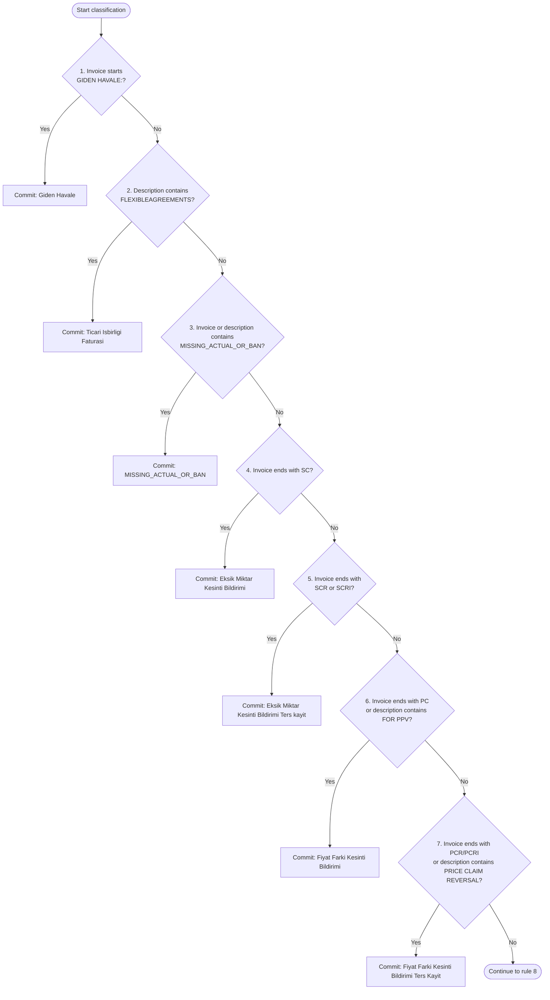
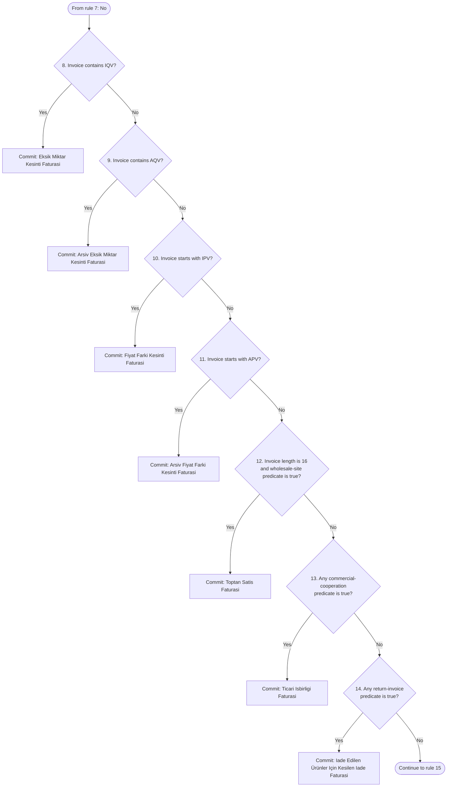
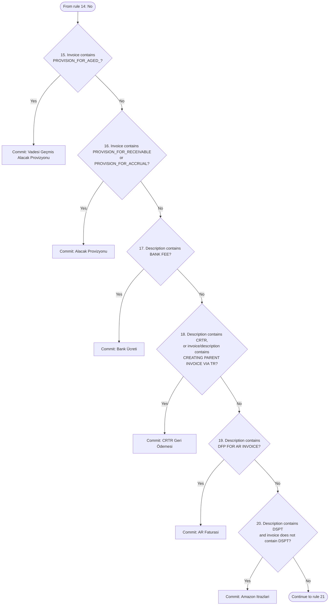
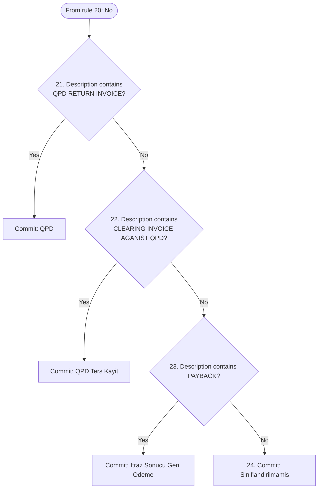

# 08 — Payment Reconciliation: Technical Design and Current Logic

## Purpose and scope

The E-Reconciliation feature processes Amazon Oracle Financials (OFA) EFT remittance advice workbooks for Turkey. It converts a semi-structured first worksheet into classified payment records, creates balancing transfer rows, displays financial analytics, and exports a multi-sheet reconciliation workbook.

This document describes the behavior that is currently reachable from the UI. It separately identifies code that exists only as scaffolding. Paths are relative to the repository root.

## User entry and authorization

- Route: `/payment-reconciliation` in `src/App.tsx`.
- Entry component: `src/features/payment-reconciliation/components/Recon.tsx`.
- Route gate: `FeatureGate` with feature ID `Recon`.
- Required entitlement: `payment-reconciliation`, mapped in `usePermissions.ts`.
- Admin users bypass feature entitlements.
- The sidebar and Home card remain visible without permission; the route then renders an Access Denied view.

The live screen accepts one `.xlsx`, `.xlsm`, or `.xls` file, displays processing/error states, renders the dashboard after successful parsing, and enables Excel download. There is no live region selector, raw-record editor, reset action, or separate FinOps/vendor statement upload.

## Runtime architecture

```text
Recon UI
  -> useReconciliationProcess('TR')
      -> File.arrayBuffer()
      -> SheetJS: workbook -> first worksheet -> unknown[][]
      -> TrOfaRemittanceProcessor.parse()
          -> section detection and extraction
          -> amount normalization
          -> TrInvoiceClassifier
          -> payment-group balancing + synthetic Giden Havale rows
      -> PaymentRecord[] in React state
          -> ReconciliationDashboard (KPIs and charts)
          -> ExcelExporter
              -> payment, transfer, filtered invoice, summary, PQV sheets
              -> ThreeWayMatchingEngine (export time only)
```

All payment-file processing is browser-local. This feature does not import Amplify Data, call `fetch`, upload to storage, or persist parsed records. Data is lost on refresh, navigation, or unmount.

## Main implementation map

| Responsibility | Implementation |
|---|---|
| Screen and upload interaction | `components/Recon.tsx` |
| File reading and state | `hooks/useReconciliationProcess.ts` |
| TR OFA extraction and balancing | `logic/processors/implementations/tr/TrOfaRemittanceProcessor.ts` |
| Invoice classification and PO extraction | `logic/classifiers/implementations/TrInvoiceClassifier.ts` |
| Runtime record contract | `types/regional.types.ts` |
| KPI and chart calculations | `components/Dashboard/ReconciliationDashboard.tsx` |
| Workbook orchestration | `utils/excelExporter.ts` |
| PQV-to-sales matching | `logic/matchers/threeWayMatchingEngine.ts` |
| Sheet builders | `components/Excel/*.tsx` |

## Input contract and validation

The browser file picker advertises Excel extensions, but extension, MIME type, file size, encryption, macro content, row count, and column count are not validated in code. `useReconciliationProcess` reads only `workbook.SheetNames[0]` and calls:

```ts
XLSX.utils.sheet_to_json(worksheet, { header: 1, raw: false })
```

`raw: false` gives the processor formatted cell strings rather than canonical numeric values.

The parser accepts the workbook only when the normalized text below appears in column A within the first 40 rows:

```text
bu e-posta, izlenmeyen bir hesaptan gonderilmistir
```

Normalization removes accents, converts Turkish `İ/ı`, lowercases text, trims it, and collapses whitespace. Missing validation marker returns `Invalid format: Oracle EFT disclaimer not found in column A.`

## Extraction pipeline

### 1. Discover remittance sections

The processor scans the complete matrix for each disclaimer occurrence. For every occurrence it:

1. Searches downward for a cell containing normalized `odeme yap`, first in the disclaimer column and then across all columns.
2. Reads seven consecutive payment metadata rows.
3. Finds the first non-empty label beginning two columns left of the disclaimer, falling back to column A.
4. Maps the normalized label to a configured payment key; if no key matches, it falls back to the expected key at that row position.
5. Uses the next non-empty cell to the right as the value.

Expected payment fields are payee, supplier number, vendor site, payment number, payment date, currency, and payment amount.

### 2. Discover invoice tables

Starting from the payment section, the parser finds a cell beginning with normalized `fatura nu`. It selects the first six non-empty header columns at or to the right of that cell and treats them as:

1. Invoice number
2. Invoice date
3. Description
4. Applied discount
5. Paid amount
6. Remaining amount

Rows continue until all six selected cells are empty. The remaining amount is extracted but not included in the runtime `PaymentRecord`. Sections without both payment metadata and a six-column invoice table are skipped. If no complete section is found, parsing fails with `No complete sections (payment + invoices) found.`

### 3. Map amounts into debit and credit

- A paid amount enclosed in parentheses becomes a debit.
- Any other paid amount becomes a credit.
- If paid amount is absent, a non-zero discount is used: negative discount becomes debit; otherwise it becomes credit.
- Negative values are moved to the opposite side.
- Non-zero debit and credit values are stored as en-US strings with two decimal places.

`parseAmount` removes all characters except digits, sign, comma, and period, removes every comma, then uses `parseFloat`. Consequently, `1,234.56` works, but Turkish `1.234,56` is interpreted incorrectly. Payment amount and discount remain source strings, creating multiple numeric representations in the same record.

## Runtime data model

`PaymentRecord` is a string-heavy structure containing payment identity, dates, currency, invoice identity, extracted PO, description, discount, credit, debit, optional balance, category, and UI row number. Dates are not normalized to a canonical type and amounts are not held as minor units or decimal values.

The hook assigns sequential `rowNumber` values only after successful parsing. A failed parse or thrown exception clears previously parsed data.

## Invoice classification

Classification is implemented by `TrInvoiceClassifier.classify(invoiceNumber, description)`. Both arguments are converted to empty strings when absent and then uppercased. No trimming, accent conversion, or punctuation removal occurs inside the classifier. Rules execute sequentially, never in parallel. A `true` condition immediately commits its category and ends classification; only a `false` condition advances to the next numbered rule.

### Sequential decision tree

The tree is split into four visual segments for readability. `Continue` means that every rule in the current segment returned `false`; execution then starts at the first numbered rule of the next segment.

#### Segment 1 — Rules 1–7



#### Segment 2 — Rules 8–14



#### Segment 3 — Rules 15–20



#### Segment 4 — Rules 21–24



Each commit node is terminal for that invocation. The numbered table below provides the same execution sequence in reference form.

### Ordered decision rules

| Order | Condition | Returned `InvoiceCategory` |
|---:|---|---|
| 1 | Invoice number starts with `GIDEN HAVALE:` | `Giden Havale` |
| 2 | Description contains `FLEXIBLEAGREEMENTS` | `Ticari Isbirligi Faturasi` |
| 3 | Description or invoice number contains `MISSING_ACTUAL_OR_BAN` | `MISSING_ACTUAL_OR_BAN` |
| 4 | Invoice number ends with `SC` | `Eksik Miktar Kesinti Bildirimi` |
| 5 | Invoice number ends with `SCR` or `SCRI` | `Eksik Miktar Kesinti Bildirimi Ters kayit` |
| 6 | Invoice number ends with `PC`, or description contains `FOR PPV` | `Fiyat Farki Kesinti Bildirimi` |
| 7 | Invoice number ends with `PCR` or `PCRI`, or description contains `PRICE CLAIM REVERSAL` | `Fiyat Farki Kesinti Bildirimi Ters Kayit` |
| 8 | Invoice number contains `IQV` | `Eksik Miktar Kesinti Faturasi` |
| 9 | Invoice number contains `AQV` | `Arsiv Eksik Miktar Kesinti Faturasi` |
| 10 | Invoice number starts with `IPV` | `Fiyat Farki Kesinti Faturasi` |
| 11 | Invoice number starts with `APV` | `Arsiv Fiyat Farki Kesinti Faturasi` |
| 12 | Invoice number length is exactly 16 and description contains any wholesale site keyword | `Toptan Satis Faturasi` |
| 13 | Any commercial-cooperation predicate matches | `Ticari Isbirligi Faturasi` |
| 14 | Any return-invoice predicate matches | `Iade Edilen Ürünler Için Kesilen Iade Faturasi` |
| 15 | Invoice number contains `PROVISION_FOR_AGED_` | `Vadesi Geçmis Alacak Provizyonu` |
| 16 | Invoice number contains `PROVISION_FOR_RECEIVABLE` or `PROVISION_FOR_ACCRUAL` | `Alacak Provizyonu` |
| 17 | Description contains `BANK FEE` | `Bank Ücreti` |
| 18 | Description contains `CRTR`, or invoice number/description contains `CREATING PARENT INVOICE VIA TR` | `CRTR Geri Ödemesi` |
| 19 | Description contains `DFP FOR AR INVOICE` | `AR Faturasi` |
| 20 | Description contains `DSPT` and invoice number does not contain `DSPT` | `Amazon Itrazlari` |
| 21 | Description contains `QPD RETURN INVOICE` | `QPD` |
| 22 | Description contains `CLEARING INVOICE AGANIST QPD` | `QPD Ters Kayit` |
| 23 | Description contains `PAYBACK` | `Itraz Sonucu Geri Odeme` |
| 24 | No prior condition matches | `Siniflandirilmamis` |

### Wholesale-site predicate

The wholesale predicate checks whether the uppercased description contains at least one of these substrings:

```text
IST, XSA8, IST1, IST2, XTRB, XTRA, XTRD,
PTRA, XTRC, PSR2, VECR, VEGX, XSA9
```

This predicate is combined with the requirement that the uppercased invoice number contain exactly 16 characters.

### Commercial-cooperation predicates

Rule 13 returns `Ticari Isbirligi Faturasi` when any of the following conditions is true:

1. Description contains `FOR TRANSACTION` or `DSPT`, and also contains a standalone 16-character C1 reference matching `\bC1[A-Z0-9]{14}\b`.
2. Invoice number begins `C1` and ends `R1`.
3. Invoice number begins `C1` or `C0`.
4. Description contains any of `VOLUME INCENTIVE`, `CO-OP`, `AVS`, or `SPA`.
5. Invoice number contains `DSPT` and description contains `C1`.
6. Invoice number ends with `R1` through `R12`, and description contains `C0` or `C1`.

For the final predicate, the suffix is parsed with `R(\d{1,2})$`; the captured number must be between 1 and 12 inclusive.

### Return-invoice predicates

Rule 14 returns `Iade Edilen Ürünler Için Kesilen Iade Faturasi` when any of the following conditions is true:

1. Invoice number begins `V1` or `V0`.
2. Description contains `FOR TRANSACTION` or `DSPT`, and contains a standalone 16-character V reference matching `\bV[A-Z0-9]{15}\b`.
3. Invoice number ends with `R` followed by one or two digits, and description contains `V1` or `V0`.
4. Description contains `VRET` or `RETURNS`.
5. Invoice number contains `DSPT`, and description contains `V1` or `V0`.

### Purchase-order extraction

PO extraction is performed separately by `extractPurchaseOrder(description)` before the category is stored. The method returns an empty string for an absent description. Otherwise it applies this case-sensitive regular expression:

```regex
([A-Z0-9]+)\/(IST2|XSA8|XTRA|XTRD|XTRC|IST1|IST|XTRB|PTRA|PSR2|VECR|VEGX|XSA9)\/
```

The returned PO number is capture group 1: one or more uppercase letters or digits immediately before a supported `/SITE/` segment. If the expression does not match, the PO number is an empty string.

### Classification output usage

The returned category is assigned directly to `PaymentRecord.invoiceType`. Dashboard aggregation, invoice filtering, synthetic transfer handling, matching, and workbook export compare this field against the same category strings.

## Group balancing and generated transfer rows

Records are grouped by the literal key:

```text
paymentNumber + "__" + paymentDate
```

For each group, source order is preserved and running balance is calculated as:

```text
running balance = previous balance + credit - debit
```

The balance is attached to every source record. The processor then always appends a synthetic `Giden Havale` record:

- Transfer amount is the absolute final group balance.
- Positive final balance produces a transfer debit.
- Negative final balance produces a transfer credit.
- Synthetic-row balance is zero.

A synthetic row is also created for a zero-balance group. Duplicate payment number/date combinations merge, and records with both values blank merge into one group.

## Dashboard calculations

The dashboard separates records by trimmed currency; blank currency defaults to USD. It can format USD, EUR, GBP, and TRY even though the live parser is TR-only.

| Metric | Calculation |
|---|---|
| Total Sales | `sum(credit + discount)` for exact `Toptan Satis Faturasi` rows |
| Remittance | For Havale rows, `sum(max(debit, paymentAmount))`; count is unique payment numbers |
| C-COGS | `sum(debit - credit)` for exact `Ticari Isbirligi Faturasi` rows |
| C-COGS / Sales | `total C-COGS / total sales including discount * 100` |
| PQV-RI | `sum(debit - credit)` for `Eksik Miktar Kesinti Faturasi` |
| PPV-RI | `sum(debit - credit)` for `Fiyat Farki Kesinti Faturasi` |
| QPD | Debit-only sum for exact `QPD` rows |

CAGR compares totals from the first and last 20% of date-sorted records and annualizes the ratio. It returns zero for insufficient records, periods under roughly one month, zero starting totals, or non-finite results. This is a custom trend indicator rather than conventional period-opening/period-closing CAGR.

The rendered dashboard contains four KPI cards, a quarterly Sales/C-COGS/Remittance chart, invoice-category distribution, sales seasonality by month across all years, and quarterly PQV/PPV/vendor-return trends. Categories below 5% of absolute invoice net volume are grouped as Other. Matching results are not shown in the dashboard.

## Excel export

`ExcelExporter.generateAndDownload` creates `<vendorSite>_Amazon_Payments_<YYYY-MM-DD>.xlsx` with five sheets:

1. **Payment Data** — all parsed and synthetic records.
2. **HAVALE** — one first-seen record per payment date/number combination. The builder currently deduplicates all records rather than explicitly filtering to `Giden Havale`.
3. **Filtered Invoices** — active invoice chains after stripping SC/SCR/PC/PCR/SCRI/PCRI suffixes, removing reversed/terminal adjustments, and linking IQV/IPV correction rows through `FOR <invoice>` descriptions.
4. **Pivot Fatura Türü** — static credit/debit totals by invoice type; it is not an Excel PivotTable.
5. **PQV-RI** — PQV records and candidate parent-sale matches.

SheetJS `writeFile` performs the download locally. Matching runs only during export.

## PQV-to-sales matching

`ThreeWayMatchingEngine` compares exact `Eksik Miktar Kesinti Faturasi` records with exact `Toptan Satis Faturasi` records.

For each PQV record:

- Parent candidate is the final 16 trimmed characters of its description.
- Match amount is debit when non-zero, otherwise credit.
- PO comes from the PQV record or from a sales record with the same parent candidate.
- Sales date must be at least 33 days **after** the PQV invoice date.
- Absolute amount difference must be no more than 0.8.
- Strict matches require the same PO when the target PO is available.
- “Worst case” matches ignore PO.

The generated key is `<PO>#<amount to two decimals>`. Candidate IDs are not ranked or deduplicated. The forward 33-day direction should be explicitly confirmed against the business policy before relying on the output as an accounting control.

## Region support: current versus scaffolded

The runtime is Turkey-only:

- `Recon` calls `useReconciliationProcess('TR')`.
- The hook always instantiates `TrOfaRemittanceProcessor`; `regionCode` does not select a processor.
- Countries selected during access request do not affect reconciliation behavior.

DE, UK, and US directories, processors, classifiers, schemas, formatters, vendor/FinOps uploaders, and localization hooks are empty or not wired. The region registry is also internally inconsistent: it references a wrong interface path and a `TurkeyConfig` export while the TR module exports `trRegionConfig`. Folder presence must not be interpreted as supported functionality.

## Error handling and operational limits

- Parser validation errors are shown inline as `Analysis Failed`.
- Workbook/SheetJS failures surface their thrown message; unknown failures use a generic message.
- Export failures are reduced to `Failed to generate Excel file.`
- Processing is synchronous on the browser main thread after file reading; large workbooks can freeze the UI.
- There is no cancellation, progress percentage, maximum file size, telemetry, persistence, or backend recovery.
- Selecting the same file twice may not fire `onChange` because the input value is not reset.
- Date parsing differs between dashboard, matcher, and export filtering.
- Empty or invalid date values can be excluded from trends or sort unpredictably.
- Positional header fallback may silently map malformed source layouts.
- No automated tests exist under the feature directory.

## Highest-priority correctness risks

1. **Locale-sensitive amount parsing:** Turkish decimal-comma values can be materially misread.
2. **Payment total is not reconciled:** the generated balancing row forces a zero balance without verifying agreement to the stated payment amount.
3. **Exact category-string coupling:** analytics and matching can silently omit reworded classifications.
4. **Date inconsistency:** multiple parsers and JavaScript date fallback can produce different results.
5. **Brittle workbook detection:** marker and position heuristics can accept shifted/misaligned data.
6. **PQV matching direction:** the 33-days-after condition may not reflect the intended parent-invoice relationship.
7. **Synthetic-row analytics:** generated Havale rows influence remittance metrics and should be clearly distinguished from source data.

## Recommended technical evolution

1. Normalize every source row once into a typed domain model with decimal minor units, canonical dates, source-row provenance, and parse warnings.
2. Split the pipeline into explicit `validate -> extract -> normalize -> classify -> reconcile -> analyze -> export` stages.
3. Replace positional fallback with schema/header validation and structured error reporting.
4. Reconcile source invoice totals, generated transfer amount, and stated payment amount with defined tolerances.
5. Move classification labels behind stable category identifiers and versioned regional rule sets.
6. Repair the region registry and inject processors by validated region code before enabling other countries.
7. Make matching date direction, tolerance, and PO policy named configuration; rank and deduplicate candidates.
8. Use a Web Worker and enforce file-size/row limits for large workbooks.
9. Add fixture-based tests for locale amounts, malformed layouts, reversals, duplicate groups, invalid dates, synthetic balancing, dashboard formulas, and workbook contents.

## Current source-of-truth boundary

The live, supported path is `Recon -> useReconciliationProcess -> TrOfaRemittanceProcessor -> ReconciliationDashboard/ExcelExporter`. Other reconciliation files should be treated as planned architecture until they are imported by this path and covered by tests.
