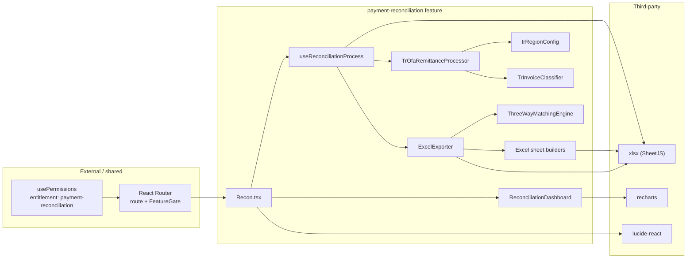
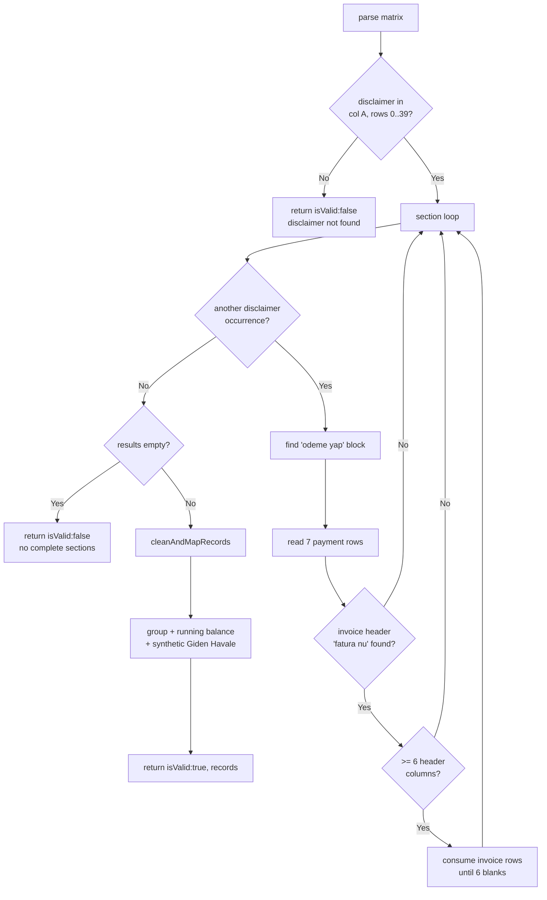
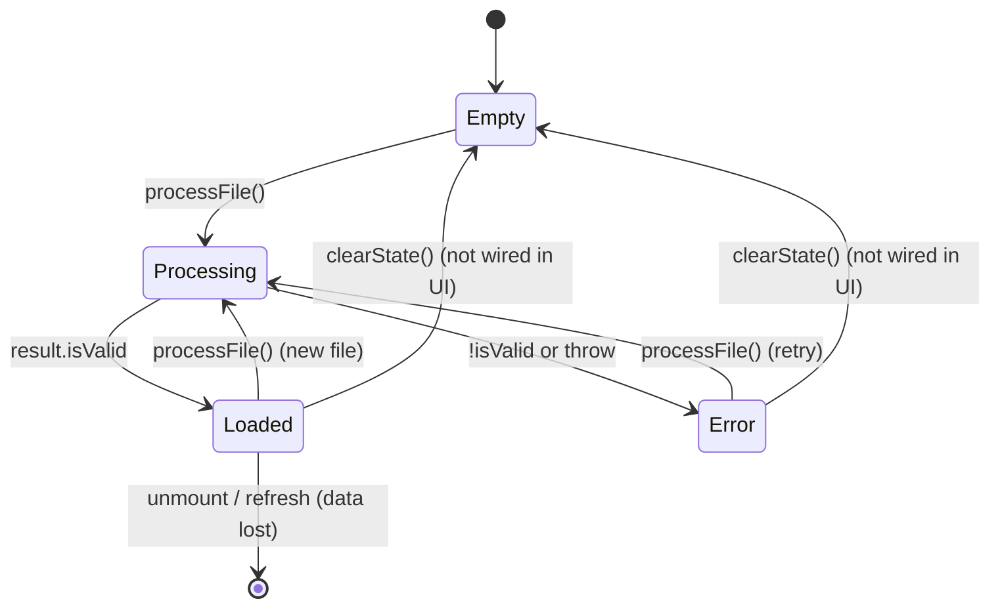

# 09 — Payment Reconciliation: Full-Stack Engineering Deep Dive

| Metadata | |
|---|---|
| Status | Living document |
| Last verified against source | 2026-07-14, `main` working tree |
| Scope | `src/features/payment-reconciliation/` plus its route/gate touch points |
| Companion documents | [08 — Technical Design and Current Logic](./08-payment-reconciliation-technical.md) (concise reference) · [06 — Risks & Roadmap](./06-risks-and-roadmap.md) (product framing) |

> Document 08 is the concise reference. This document is the implementation-level engineering paper: module topology, function contracts, data structures, algorithms with complexity, control/state flow, invariants, failure modes, and concrete extension/testing recipes.
>
> Every claim is traceable to source under `src/features/payment-reconciliation/`. Paths are repository-root relative.
>
> **Line-citation caveat:** `L{n}` references (used mainly in §9) were verified on the date above. Line numbers drift with any edit to the cited file; when in doubt, navigate by the quoted symbol/condition, not the number, and update this document alongside classifier changes.

## Table of contents

1. [Audience and how to use this paper](#1-audience-and-how-to-use-this-paper)
2. [Feature boundary and dependency graph](#2-feature-boundary-and-dependency-graph)
3. [Module topology](#3-module-topology)
4. [End-to-end runtime sequence](#4-end-to-end-runtime-sequence)
5. [Layer 1 — UI component (`Recon.tsx`)](#5-layer-1--ui-component-recontsx)
6. [Layer 2 — orchestration hook (`useReconciliationProcess`)](#6-layer-2--orchestration-hook-usereconciliationprocess)
7. [Layer 3 — processor base contract](#7-layer-3--processor-base-contract)
8. [Layer 4 — TR OFA processor internals](#8-layer-4--tr-ofa-processor-internals)
9. [Layer 5 — classification and PO extraction](#9-layer-5--classification-and-po-extraction)
10. [Layer 6 — dashboard analytics](#10-layer-6--dashboard-analytics)
11. [Layer 7 — export and matching](#11-layer-7--export-and-matching)
12. [Data structures and type systems](#12-data-structures-and-type-systems)
13. [Numeric, date, and text normalization](#13-numeric-date-and-text-normalization)
14. [State model and lifecycle](#14-state-model-and-lifecycle)
15. [Complexity and performance profile](#15-complexity-and-performance-profile)
16. [Invariants and where they hold](#16-invariants-and-where-they-hold)
17. [Failure modes and observability](#17-failure-modes-and-observability)
18. [Dead, dormant, and duplicate code](#18-dead-dormant-and-duplicate-code)
19. [Extension recipes](#19-extension-recipes)
20. [Test strategy](#20-test-strategy)
21. [Defect register](#21-defect-register)
22. [Glossary](#22-glossary)

---

## 1. Audience and how to use this paper

This paper targets an engineer who must **modify, extend, debug, or review** the reconciliation feature. It assumes fluency with React hooks, TypeScript, and spreadsheet processing (SheetJS/`xlsx`). It does not assume prior knowledge of the OFA remittance format or the Turkish accounting vocabulary used in the code.

Reading paths:

- **Onboarding to the feature:** sections 2 → 3 → 4, then 5–11 in order.
- **Debugging a parse failure:** sections 7 → 8 → 13 → 17.
- **Adding a region:** sections 3 → 7 → 19.
- **Auditing correctness:** sections 12 → 13 → 16 → 21.

### Notation and conventions

| Notation | Meaning |
|---|---|
| `§n` | Section *n* of this document (e.g., §8.4). `08 §…` refers to document 08. |
| `L{n}` / `L{a}–{b}` | Line number(s) in the file named nearest above the citation |
| `INV`, `DESC` | Uppercased `invoiceNumber` / `description` classifier inputs (defined in §9.2) |
| `A ∋ 'x'` | Shorthand for `A.includes('x')` |
| `Σ(...)` | Sum over the filtered record set |
| **LIVE** | File reachable from the mounted route at runtime |
| **DORMANT** | File implemented but not imported by any live path |
| **EMPTY** | File exists with no meaningful content |
| Dn / In | Entry in the defect register (§21) / invariant table (§16) |

---

## 2. Feature boundary and dependency graph

The feature is a **self-contained client-side pipeline**. It has no server calls, no persistence, and no shared global state beyond React auth context used for the route gate.



Edges are import/call relationships: `Recon` renders `ReconciliationDashboard` with the hook's `parsedData`; the hook itself never references the dashboard.

### Runtime dependencies (only what the live path uses)

| Package | Version (caret) | Used for |
|---|---|---|
| `react` | ^19.2.0 | Component + hook state |
| `xlsx` | ^0.18.5 | Workbook read (`read`, `sheet_to_json`) and write (`writeFile`, `json_to_sheet`, `book_*`) |
| `recharts` | ^3.6.0 | Dashboard charts |
| `lucide-react` | ^0.562.0 | Icons in `Recon` and dashboard cards |
| `bootstrap` | ^5.3.8 | Layout classes in `Recon.tsx` |

`file-saver` is declared in `package.json` but this feature does not use it; download is performed by SheetJS `writeFile`. `react-toastify` is mounted globally in `App` but the feature emits no toasts.

---

## 3. Module topology

```text
src/features/payment-reconciliation/
├── index.ts                         (empty — no barrel export)
├── components/
│   ├── Recon.tsx                    LIVE  entry component
│   ├── Dashboard/
│   │   └── ReconciliationDashboard.tsx  LIVE  analytics view
│   ├── Excel/
│   │   ├── PaymentDataSheet.tsx     LIVE  sheet builder
│   │   ├── HavaleSheet.tsx          LIVE  sheet builder
│   │   ├── FilteredInvoicesSheet.tsx LIVE sheet builder
│   │   ├── PqvReconciliationSheet.tsx LIVE sheet builder
│   │   └── PpvReconciliationSheet.tsx  EMPTY (not imported)
│   └── Uploaders/
│       ├── OfaRemittanceUploader.tsx   DORMANT (self-contained, not mounted)
│       ├── FinOpsDataUploader.tsx      EMPTY
│       └── VendorStatementUploader.tsx EMPTY
├── config/regions/
│   ├── index.ts                     DORMANT/BROKEN registry (wrong imports)
│   └── implementations/
│       ├── tr.config.ts             LIVE  trRegionConfig
│       ├── de.config.ts             EMPTY
│       ├── uk.config.ts             EMPTY
│       ├── us.config.ts             EMPTY
│       ├── base/RegionConfig.interface.ts  interface only
│       └── schemas/*                EMPTY
├── constants/
│   ├── invoiceCategories.ts         DORMANT English enum (unused by live path)
│   └── paymentTypes.ts              DORMANT RegionCode/CurrencyCode/DataSource
├── hooks/
│   ├── useReconciliationProcess.ts  LIVE  orchestration
│   ├── useLocalization.ts           EMPTY
│   └── useRegionConfig.ts           EMPTY
├── logic/
│   ├── classifiers/
│   │   ├── base/BaseInvoiceClassifier.ts   LIVE  abstract base
│   │   └── implementations/
│   │       ├── TrInvoiceClassifier.ts      LIVE
│   │       ├── DeInvoiceClassifier.ts      EMPTY
│   │       └── UkInvoiceClassifier.ts      EMPTY
│   ├── cleaners/
│   │   ├── dataSanitizer.ts         DORMANT (DataSanitizer, unused by live path)
│   │   └── paymentTransformer.ts    EMPTY
│   ├── matchers/
│   │   └── threeWayMatchingEngine.ts LIVE (export time only)
│   ├── processors/
│   │   ├── base/
│   │   │   ├── BaseRemittanceProcessor.ts  LIVE abstract base
│   │   │   ├── BaseFinOpsProcessor.ts      EMPTY
│   │   │   └── BaseVendorProcessor.ts      EMPTY
│   │   └── implementations/
│   │       ├── tr/TrOfaRemittanceProcessor.ts LIVE
│   │       ├── tr/FinOpsProcessor.ts          EMPTY
│   │       ├── tr/VendorProcessor.ts          EMPTY
│   │       ├── de/OfaRemittanceProcessor.ts   EMPTY
│   │       ├── uk/OfaRemittanceProcessor.ts   EMPTY
│   │       └── us/OfaRemittanceProcessor.ts   EMPTY
│   └── validators/
│       └── fileIntegrityValidator.ts EMPTY
├── types/
│   ├── regional.types.ts            LIVE  PaymentRecord, ParsingResult, InvoiceCategory
│   └── common.types.ts              DORMANT alternate canonical model
└── utils/
    ├── excelExporter.ts             LIVE  workbook orchestration
    └── formatters/
        ├── currencyFormatter.ts     EMPTY
        ├── dateFormatter.ts         EMPTY
        ├── numberFormatter.ts       EMPTY
        └── parsers/{emailParser,tableParser}.ts EMPTY
```

**LIVE** = reachable from the mounted route. **DORMANT** = implemented but not imported by the live path. **EMPTY** = file exists with no meaningful content. See section 18 for the full inventory and implications.

---

## 4. End-to-end runtime sequence

```mermaid
sequenceDiagram
    actor U as User
    participant R as Recon.tsx
    participant H as useReconciliationProcess
    participant X as SheetJS
    participant P as TrOfaRemittanceProcessor
    participant C as TrInvoiceClassifier
    participant D as ReconciliationDashboard
    participant E as ExcelExporter
    participant M as ThreeWayMatchingEngine

    U->>R: select .xlsx/.xlsm/.xls
    R->>H: processFile(file)
    H->>H: setIsProcessing(true); reset error/success
    H->>X: file.arrayBuffer() -> XLSX.read(type:'array')
    X-->>H: workbook
    H->>X: sheet_to_json(sheet0, {header:1, raw:false})
    X-->>H: unknown[][] matrix
    H->>P: new TrOfaRemittanceProcessor().parse(matrix)
    P->>P: extractRawSections(matrix)
    alt disclaimer marker missing
        P-->>H: {isValid:false, message}
        H->>R: setError(message); parsedData=[]
    else sections found
        P->>C: classify(invoiceNumber, description) per row
        C-->>P: InvoiceCategory
        P->>P: group by paymentNumber__paymentDate; running balance; append Giden Havale
        P-->>H: {isValid:true, records}
        H->>H: assign rowNumber=index+1; setParsedData
        H->>R: success; render dashboard
        R->>D: <ReconciliationDashboard data={parsedData}/>
        D->>D: useMemo KPIs/charts by currency
    end
    U->>R: click Download Excel Report
    R->>H: exportExcel()
    H->>E: generateAndDownload(records, vendorSite)
    E->>M: matchPqvToSales(records)
    M-->>E: PqvMatchResult[]
    E->>X: build 5 sheets -> writeFile(name.xlsx)
    X-->>U: browser download
```

Two facts an engineer must internalize:

1. **Matching does not run for the dashboard.** `ThreeWayMatchingEngine` is invoked only inside `ExcelExporter.generateAndDownload`. Screen KPIs and the matching sheet are computed by different code with different assumptions.
2. **`raw: false`** means the processor receives display strings, not JS numbers/dates. All numeric and date interpretation happens later on strings.

---

## 5. Layer 1 — UI component (`Recon.tsx`)

**File:** `components/Recon.tsx`.

Responsibilities: render upload control, drive the four visual states, and forward the file to the hook.

```tsx
const { parsedData, isProcessing, error, successMessage, processFile, exportExcel }
  = useReconciliationProcess('TR');

const handleFileUpload = (e: React.ChangeEvent<HTMLInputElement>) => {
  const file = e.target.files?.[0];
  if (file) processFile(file);
};

const hasData = parsedData && parsedData.length > 0;
```

State rendering matrix:

| Condition | Rendered |
|---|---|
| `isProcessing` | Bootstrap spinner + "Analyzing payment data…" |
| `error` | `alert-danger` with `Analysis Failed: {error}` |
| `!hasData && !isProcessing && !error` | Empty state placeholder |
| `hasData && !isProcessing` | optional success alert + `<ReconciliationDashboard data={parsedData}/>` |

Interaction notes for engineers:

- The `regionCode` argument is the string literal `'TR'`. It has no runtime effect beyond being a hook dependency (see section 6).
- The file `<input>` `value` is never reset. Selecting the **same** file twice may not fire `onChange`, so re-processing an identical filename can silently no-op. A fix is `e.target.value = ''` after dispatch, or exposing `clearState`.
- `exportExcel` is only reachable after `hasData` is true, so export always has ≥1 record.
- `clearState` exists on the hook but is **not** destructured or wired to any control here; there is no reset button.

---

## 6. Layer 2 — orchestration hook (`useReconciliationProcess`)

**File:** `hooks/useReconciliationProcess.ts`. Signature:

```ts
useReconciliationProcess(regionCode: string = 'TR'): {
  parsedData: PaymentRecord[];
  isProcessing: boolean;
  error: string | null;
  successMessage: string | null;
  fileName: string;
  processFile: (file: File) => Promise<void>;
  exportExcel: () => void;
  clearState: () => void;
}
```

`processFile` control flow (condensed from source; comments added):

```ts
setIsProcessing(true); setError(null); setSuccessMessage(null); setFileName(file.name);
try {
  const arrayBuffer = await file.arrayBuffer();
  const workbook   = XLSX.read(arrayBuffer, { type: 'array' });
  const sheet      = workbook.Sheets[workbook.SheetNames[0]];      // first sheet only
  const rawData    = XLSX.utils.sheet_to_json(sheet, { header: 1, raw: false }) as unknown[][];

  const processor  = new TrOfaRemittanceProcessor();               // hardcoded region
  const result     = processor.parse(rawData);

  if (!result.isValid) { setError(result.message); setParsedData([]); }
  else {
    const withIds = result.records.map((r, i) => ({ ...r, rowNumber: i + 1 }));
    setParsedData(withIds); setSuccessMessage(result.message);
  }
} catch (err) {
  setError(err instanceof Error ? err.message : 'Unknown error during file processing');
  setParsedData([]);
} finally { setIsProcessing(false); }
```

Engineering observations:

- **Region binding is static.** `regionCode` is captured in the `useCallback` dependency array but the body always constructs `TrOfaRemittanceProcessor`. To make region dynamic, this is the single injection point to change (section 19).
- **`rowNumber` is assigned post-parse**, 1-based, over the full record array **including synthetic Giden Havale rows**. Therefore `rowNumber` is a display ordinal, not a source-row pointer.
- **`exportExcel`** derives the filename prefix from `parsedData[0]?.vendorSite || 'Vendor'`. If the first record is a synthetic transfer row, the prefix still comes from that row’s `vendorSite` (which is copied from the group reference row).
- Errors collapse to a single string; there is no structured error object, error code, or per-row diagnostic.

---

## 7. Layer 3 — processor base contract

**File:** `logic/processors/base/BaseRemittanceProcessor.ts`.

The abstract base defines the region contract and shared helpers:

```ts
protected abstract getDisclaimerText(): string;
protected abstract getPaymentHeaderText(): string;
protected abstract getInvoiceHeaderText(): string;
protected abstract getPaymentHeaderMapping(): Record<string, string>;
protected abstract mapPaymentLabel(label: string): string | null;
public   abstract parse(worksheet: unknown[][]): ParsingResult;
```

Shared helpers provided by the base:

| Helper | Behavior |
|---|---|
| `normalizeText(text)` | `NFD` decompose, strip `\u0300–\u036f` diacritics, `İ→I`, `ı→i`, lowercase, trim, collapse internal whitespace to single spaces. Non-strings coerced (`null/undefined → ''`). |
| `isValuePresent(v)` | false for null/undefined/`NaN`/empty-after-trim; true otherwise. |
| `findFirstValueInRow(row, start=0)` | first present cell `[index, value]` or `[null, null]`. |
| `findNextValueToRight(row, col)` | next present cell strictly right of `col`. |
| `validateWorksheet(ws)` | checks disclaimer marker in column A of first 40 rows; returns rich `{isValid, message}`. **Not called by the TR processor** — TR reimplements the check inline (section 8). |

The `normalizeText` policy is the canonical text contract for the format, but note the divergence: the live TR path uses its own inline normalization/helper names rather than `normalizeText`/`validateWorksheet`. Two normalization implementations therefore coexist; keep them in sync if you touch either.

---

## 8. Layer 4 — TR OFA processor internals

**File:** `logic/processors/implementations/tr/TrOfaRemittanceProcessor.ts`.
**Config:** `config/regions/implementations/tr.config.ts` (`trRegionConfig`).

### 8.1 Config-driven markers and headers

```ts
markers: {
  paymentStart:    'odeme yap',
  emailDisclaimer: 'bu e-posta, izlenmeyen bir hesaptan gonderilmistir',
}
headers.payment: ['Odeme yap?lacak taraf:', 'Tedarikci Numaran?z:', 'Tedarikci site ad?:',
                  'Odeme numaras?:', 'Odeme tarihi:', 'Odeme para birimi:', 'Odeme tutar?:']
headers.invoice: ['Fatura Numaras?', 'Fatura Tarihi', 'Fatura Ac?klamas?',
                  'Uygulanan ?ndirim', 'Odenen Tutar', 'Kalan Tutar']
mappings: { 'odeme yapilacak taraf': 'Odeme yap?lacak taraf:', ... }  // 7 entries
```

The `?` characters in the header keys are literal (mojibake stand-ins for Turkish characters). `cleanAndMapRecords` reads raw rows using these exact keys, so they must match the parser’s emitted keys byte-for-byte. `getInvoiceHeaderText()` returns the hardcoded literal `'fatura nu'` (not sourced from config).

### 8.2 `parse()` orchestration

```ts
public parse(fileContent: unknown[][]): ParsingResult {
  const matrix = this.createMatrix(fileContent);          // identity pass-through
  const extraction = this.extractRawSections(matrix);
  if (!extraction.ok) return { isValid: false, records: [], message: extraction.msg };
  const cleaned = this.cleanAndMapRecords(extraction.results);
  return { isValid: true, records: cleaned, message: `Successfully parsed ${cleaned.length} records.` };
}
```

### 8.3 `extractRawSections()` — the core scanner

Algorithm (all comparisons on accent-stripped, lowercased text):

1. **Format gate.** Scan `min(40, rows)` cells of **column 0** for the disclaimer marker. If absent → `{ ok:false, msg:'Invalid format: Oracle EFT disclaimer not found in column A.' }`.
2. **Section loop** (`currentRow` cursor advancing to end of matrix):
   1. **Find section header:** scan from `currentRow` across all columns for a cell containing the disclaimer marker; record `(headerRowIndex, headerColIndex)`. If none → break loop.
   2. **Find payment block:** from the header row down the disclaimer column, find the payment marker `odeme yap`; if not found in that column, fall back to scanning all columns.
   3. **Read 7 payment rows:** for `i` in `0..6` starting at `paymentStartRow`:
      - Find the first present label starting at `max(0, headerColIndex − 2)`; fall back to column 0.
      - Map the label via `mapPaymentLabel`; if unmapped and `i < 7`, fall back positionally to `headers.payment[i]`.
      - Value = next present cell to the right of the label. Store into `paymentValues[canonicalKey]`.
   4. **Find invoice header:** scan from `paymentStartRow` across all columns for a cell whose normalized text **starts with** `fatura nu`; record `(invoiceHeaderRow, invoiceHeaderCol)`.
   5. **Select 6 table columns:** collect the first six present header columns at/right of `invoiceHeaderCol`; if fewer than six, retry starting one column right. If still `< 6` → skip section (`currentRow = invoiceHeaderRow + 1`).
   6. **Consume invoice rows:** from `invoiceHeaderRow + 1` downward, read the six selected columns per row; stop when all six are empty (`nonEmptyCount === 0`). Each row becomes `{ ...paymentValues, [invoiceHeaders[k]]: cell }`.
   7. **Advance cursor:** `currentRow = extractedAny ? lastRow + 1 : invoiceHeaderRow + 1`.
3. If `results.length === 0` → `{ ok:false, msg:'No complete sections (payment + invoices) found.' }`.

`mapPaymentLabel` normalization: strip accents → remove `:` → replace `-` with space → prefix-match against `mappings` keys → return canonical mojibake header or `null`.

### 8.4 `cleanAndMapRecords()` — normalization + balancing

Per raw row:

- Reads the exact mojibake keys into typed fields (`payee`, `supplierNumber`, `vendorSite`, `paymentNumber`, `paymentDate`, `currency`, `paymentAmount`, `invoiceNumber`, `invoiceDate`, `description`, `discount` default `'0'`, `paid`).
- **Debit/credit derivation:**
  - `paid` wrapped in parentheses `(x)` → `debit = x`.
  - else non-empty `paid` → `credit = paid`.
  - else if `discount` non-zero → negative discount → `debit`; positive → `credit`.
- `parseAmount` both sides; if a side is negative, move its magnitude to the opposite side (normalize to non-negative debit/credit).
- Classify: `invoiceType = classifier.classify(invoiceNumber, description)`; `poNumber = classifier.extractPurchaseOrder(description) || ''`.
- Non-zero credit/debit re-serialized via `formatNumber` (en-US, 2 decimals). Carries private `__creditNum` / `__debitNum` numeric shadows for balancing.

**Grouping + synthetic transfer:**

```text
key = paymentNumber + "__" + paymentDate            // first-seen order preserved
for each group:
    running = 0
    for each row: running += __creditNum; running -= __debitNum; row.balance = fmt(running)
    append synthetic row:
        invoiceType   = 'Giden Havale'
        invoiceNumber = 'GIDEN HAVALE: <paymentNumber>'
        transfer      = abs(running)
        credit/debit  = running > 0 ? debit=transfer : credit=transfer
        balance       = 0
```

The synthetic row is appended for **every** group, including zero-balance groups. Blank `paymentNumber` and blank `paymentDate` collapse to a single `"__"` group.

### 8.5 TR processor control flow



---

## 9. Layer 5 — classification and PO extraction

This is the most domain-heavy layer. An engineer editing it needs three things: (a) how the raw EFT remittance advice becomes the Excel worksheet the parser sees, (b) exactly which two strings classification reads and where they come from, and (c) what each token in those strings is understood to mean so a rule change is grounded rather than guessed.

The **ordered rules, decision-tree diagrams, and exact predicate/regex definitions** are the neutral source of truth in **[08 §Invoice classification](./08-payment-reconciliation-technical.md#invoice-classification)**. This section adds the provenance and the reasoning that 08 deliberately omits. Where a token’s business meaning is not stated in code, it is marked **(inferred)** and grounded in the code’s own helper-method names and category labels — not invented.

### 9.1 Genesis of the data: EFT remittance advice → Excel worksheet

Classification does not start from a database or an API. It starts from an **Oracle Financials (OFA) EFT remittance advice** — the notification Amazon’s payables system sends a vendor when it settles a batch of invoices by electronic funds transfer (EFT). The reconciliation feature never contacts OFA; it consumes a spreadsheet the operator produces from that advice.


Two facts about this conversion drive every later design choice:

1. **The layout is not a clean table.** The advice is a formatted document (header block, payment summary, then an invoice table), and pasting it into Excel preserves that free-form shape: labels and values land in whatever columns the paste produced, often with leading blank columns and merged-looking gaps. The code’s own guard message confirms the intended workflow — `BaseRemittanceProcessor.validateWorksheet` tells the user *“Please ensure you have pasted the remittance email directly into Excel.”* This is why the processor is **marker/position based** (find the disclaimer, then `odeme yap`, then `fatura nu`) rather than reading fixed columns (section 8.3).
2. **Everything is text.** `sheet_to_json(..., { raw: false })` hands the processor **formatted display strings**, not numbers or dates. So the invoice number and description that classification reads are exactly the strings a human would see in the pasted advice — including any OFA-generated prefixes/suffixes and free-text notes. Classification is, in effect, pattern-reading the payables system’s own naming conventions.

A representative pasted layout (column A on the left) looks like:

```text
Row  Col A                                              Col B ...
 3   Bu e-posta, izlenmeyen bir hesaptan gönderilmiştir.   (disclaimer marker → format gate + section anchor)
 5   Ödeme yapılacak taraf:            ACME TEDARIK A.S.    (payment block start → 'odeme yap')
 6   Tedarikçi Numaranız:              100234
 7   Tedarikçi site adı:               ACME-IST2
 8   Ödeme numarası:                   PAY000998877
 9   Ödeme tarihi:                     14-JUL-2026
10   Ödeme para birimi:                TRY
11   Ödeme tutarı:                     125.400,00
13   Fatura Numarası  Fatura Tarihi  Fatura Açıklaması  Uygulanan İndirim  Ödenen Tutar  Kalan Tutar
14   1F7X...16chars   12-JUN-2026    ... /IST2/ ...      0,00               118.000,00    0,00
15   1F7X...SC        20-JUN-2026    SHORTAGE FOR ...    0,00               (2.600,00)    0,00
...
```

The parser turns each invoice row into one raw record that also carries the seven payment fields from the block above it (section 8.4). Only two of that record’s fields feed classification.

### 9.2 Inputs and reading key

`TrInvoiceClassifier.classify(invoiceNumber, description)` (`TrInvoiceClassifier.ts` L12) reads **only two strings**, both uppercased on entry (L13–14). It never consults amounts, dates, currency, PO, balance, or any other record. In the tables below:

- **INV** = `invoiceNumber.toUpperCase()` — from advice column *Fatura Numarası*.
- **DESC** = `description.toUpperCase()` — from advice column *Fatura Açıklaması*.
- **Precedence rule (applies to every row):** a rule fires only when its *Trigger* is `true` **and** every lower-numbered rule was `false`. The first `true` returns immediately (see decision tree in [08](./08-payment-reconciliation-technical.md#invoice-classification)).

### 9.3 Classification decision table

Meaning column: tokens grounded in the classifier’s own helper names/labels; **(inf.)** = inferred from naming, not external docs.

All line citations in this table refer to `logic/classifiers/implementations/TrInvoiceClassifier.ts` (see line-citation caveat in the header).

| # | Line | Reads | Trigger — fires when `true` | Must also be `false` | → `invoiceType` | Meaning |
|---:|---|---|---|---|---|---|
| 1 | L16 | INV | `INV.startsWith('GIDEN HAVALE:')` | — | `Giden Havale` | Processor-injected transfer row (§8.4) |
| 2 | L20 | DESC | `DESC.includes('FLEXIBLEAGREEMENTS')` | rule 1 | `Ticari Isbirligi Faturasi` | Co-op agreement billing (inf.) |
| 3 | L24 | INV/DESC | `DESC.includes('MISSING_ACTUAL_OR_BAN') \|\| INV.includes('MISSING_ACTUAL_OR_BAN')` | rules 1–2 | `MISSING_ACTUAL_OR_BAN` | OFA missing actual/bank sentinel (inf.) |
| 4 | L28 · helper L114 | INV | `INV.endsWith('SC')` | rules 1–3 | `Eksik Miktar Kesinti Bildirimi` | **S**hortage **C**laim notice |
| 5 | L32 · L118 | INV | `INV.endsWith('SCR') \|\| INV.endsWith('SCRI')` | rules 1–4 | `Eksik Miktar Kesinti Bildirimi Ters kayit` | Shortage-claim reversal |
| 6 | L36 · L122 | INV/DESC | `INV.endsWith('PC') \|\| DESC.includes('FOR PPV')` | rules 1–5 | `Fiyat Farki Kesinti Bildirimi` | **P**rice **C**laim notice |
| 7 | L40 · L126 | INV/DESC | `INV.endsWith('PCR') \|\| INV.endsWith('PCRI') \|\| DESC.includes('PRICE CLAIM REVERSAL')` | rules 1–6 | `Fiyat Farki Kesinti Bildirimi Ters Kayit` | Price-claim reversal |
| 8 | L44 | INV | `INV.includes('IQV')` | rules 1–7 | `Eksik Miktar Kesinti Faturasi` | Quantity-variance invoice / PQV-RI (inf.) |
| 9 | L48 | INV | `INV.includes('AQV')` | rules 1–8 | `Arsiv Eksik Miktar Kesinti Faturasi` | Archived quantity-variance invoice (inf.) |
| 10 | L52 | INV | `INV.startsWith('IPV')` | rules 1–9 | `Fiyat Farki Kesinti Faturasi` | Price-variance invoice / PPV-RI (inf.) |
| 11 | L56 | INV | `INV.startsWith('APV')` | rules 1–10 | `Arsiv Fiyat Farki Kesinti Faturasi` | Archived price-variance invoice (inf.) |
| 12 | L60 · helper L130 | INV/DESC | `isWholesaleInvoice(DESC) === true && INV.length === 16` | rules 1–11 | `Toptan Satis Faturasi` | Wholesale sales invoice (16-char no. + site code) |
| 13 | L64 · helper L135 | INV/DESC | `isCoopInvoice(INV, DESC) === true` | rules 1–12 | `Ticari Isbirligi Faturasi` | Commercial cooperation (C0/C1 family) |
| 14 | L68 · helper L165 | INV/DESC | `isReturnInvoice(INV, DESC) === true` | rules 1–13 | `Iade Edilen Ürünler Için Kesilen Iade Faturasi` | Vendor/product return (V0/V1 family) |
| 15 | L72 | INV | `INV.includes('PROVISION_FOR_AGED_')` | rules 1–14 | `Vadesi Geçmis Alacak Provizyonu` | Aged-receivable provision (inf.) |
| 16 | L76 | INV | `INV.includes('PROVISION_FOR_RECEIVABLE') \|\| INV.includes('PROVISION_FOR_ACCRUAL')` | rules 1–15 | `Alacak Provizyonu` | Receivable/accrual provision (inf.) |
| 17 | L80 | DESC | `DESC.includes('BANK FEE')` | rules 1–16 | `Bank Ücreti` | Bank fee (inf.) |
| 18 | L84 | INV/DESC | `DESC.includes('CRTR') \|\| INV.includes('CREATING PARENT INVOICE VIA TR') \|\| DESC.includes('CREATING PARENT INVOICE VIA TR')` | rules 1–17 | `CRTR Geri Ödemesi` | CRTR repayment / parent creation (inf.) |
| 19 | L88 | DESC | `DESC.includes('DFP FOR AR INVOICE')` | rules 1–18 | `AR Faturasi` | Accounts-receivable invoice (inf.) |
| 20 | L92 | INV/DESC | `DESC.includes('DSPT')` | rules 1–19 **and** `INV.includes('DSPT') === false` | `Amazon Itrazlari` | Amazon dispute (inf.) |
| 21 | L96 | DESC | `DESC.includes('QPD RETURN INVOICE')` | rules 1–20 | `QPD` | Quantity/price dispute return (inf.) |
| 22 | L100 | DESC | `DESC.includes('CLEARING INVOICE AGANIST QPD')` | rules 1–21 | `QPD Ters Kayit` | QPD clearing/reversal (`AGANIST` literal in code) |
| 23 | L104 | DESC | `DESC.includes('PAYBACK')` | rules 1–22 | `Itraz Sonucu Geri Odeme` | Post-dispute payback (inf.) |
| 24 | L108 | — | *(none — default)* | rules 1–23 all `false` | `Siniflandirilmamis` | Unclassified fallback |

Note on rules 4–5 / 6–7: no reorder hazard exists because `'…SCR'.endsWith('SC')` is `false` (ends in `R`); the claim rule cannot swallow its reversal.

### 9.4 Predicate-helper expansion (rules 12–14)

Each helper returns `true` if **any** branch is `true`. `INV0_2` = `INV.slice(0,2)`.

Line citations again refer to `TrInvoiceClassifier.ts`.

| Helper · declared at | Branch (any `true` ⇒ helper `true`) | Line |
|---|---|---|
| `isWholesaleInvoice(DESC)` · L130 | `DESC` includes any of `IST, XSA8, IST1, IST2, XTRB, XTRA, XTRD, PTRA, XTRC, PSR2, VECR, VEGX, XSA9` | L131–132 |
| `isCoopInvoice` · L135 | `(DESC∋'FOR TRANSACTION' \|\| DESC∋'DSPT') && /\bC1[A-Z0-9]{14}\b/.test(DESC)` | L137–140 |
| | `INV0_2==='C1' && INV.slice(-2)==='R1'` | L142 |
| | `INV0_2==='C1' \|\| INV0_2==='C0'` | L143 |
| | `DESC` includes any of `VOLUME INCENTIVE, CO-OP, AVS, SPA` | L145–146 |
| | `INV.includes('DSPT') && DESC.includes('C1')` | L148 |
| | `/R(\d{1,2})$/` on INV with value 1–12 **and** (`DESC∋'C0' \|\| DESC∋'C1'`) | L150–157 |
| `isReturnInvoice` · L165 | `INV0_2==='V1' \|\| INV0_2==='V0'` | L168 |
| | `(DESC∋'FOR TRANSACTION' \|\| DESC∋'DSPT') && /\bV[A-Z0-9]{15}\b/.test(DESC)` | L170–173 |
| | `/R(\d{1,2})$/` on INV **and** (`DESC∋'V1' \|\| DESC∋'V0'`) — note: no 1–12 bound here | L175 |
| | `DESC∋'VRET' \|\| DESC∋'RETURNS'` | L177 |
| | `INV.includes('DSPT') && (DESC∋'V1' \|\| DESC∋'V0')` | L179 |

### 9.5 PO extraction and downstream coupling

| Concern | Location | Behavior |
|---|---|---|
| PO extraction | `extractPurchaseOrder` L6–9 (regex L8) | `''` if DESC empty; else capture group 1 of `/([A-Z0-9]+)\/(IST2\|XSA8\|XTRA\|XTRD\|XTRC\|IST1\|IST\|XTRB\|PTRA\|PSR2\|VECR\|VEGX\|XSA9)\//` — the token immediately before a `/SITE/` segment (`IST2` precedes `IST` so the longer code wins). No match ⇒ `''`. Runs in `cleanAndMapRecords` after `classify`. |
| Output | `PaymentRecord.invoiceType` | Category string written verbatim; becomes the cross-module contract. |
| Consumers of the exact literal | dashboard (§10.3), `FilteredInvoicesSheet`, `ThreeWayMatchingEngine` (§11.3), pivot sheet | Compared with `===` / `includes`; renaming or re-spelling any literal (incl. `AGANIST`, diacritics in `Ürünler`/`Geçmis`) is a breaking change — see D3 (§21), I8 (§16). |

---

## 10. Layer 6 — dashboard analytics

**File:** `components/Dashboard/ReconciliationDashboard.tsx`. Input prop: `data: PaymentRecord[]`.

### 10.1 Currency partitioning

Pseudocode (behavioral summary of the two `useMemo` blocks):

```text
availableCurrencies = unique(data.map(r => r.currency?.trim() || 'USD')).sort()
filteredData = data.filter(r => (r.currency?.trim() || 'USD') === selectedCurrency)
                   .sortBy(r => new Date(r.paymentDate))
```

Blank currency defaults to `USD`. Currency tabs render only when more than one currency is present. Formatting uses `Intl.NumberFormat` with `localeMap = { USD:'en-US', EUR:'de-DE', GBP:'en-GB', TRY:'tr-TR' }`; TRY output is post-processed to force `symbol` before the number.

### 10.2 In-dashboard amount parser (separate from the processor)

Behavior (one-line summary of `parseCurrency`):

```text
parseCurrency(input) = parseFloat(String(input).replace(/[^\d.-]/g, '')) || 0
```

This strips commas and any non-`[0-9.-]` character. It is **a third numeric parser** in the feature (processor `parseAmount`, `DataSanitizer.parseAmount`, dashboard `parseCurrency`), each with slightly different rules.

### 10.3 KPI formulas (exact)

| KPI | Row filter on `invoiceType` | Match kind | Aggregation |
|---|---|---|---|
| Total Sales | `Toptan Satis Faturasi` | exact `===` | `Σ(credit + discount)` |
| Remittance total | `HAVALE` | substring (uppercased) | `Σ max(debit, paymentAmount)` |
| Remittance count | `HAVALE` | substring (uppercased) | `distinct paymentNumber` |
| C-COGS | `Ticari Isbirligi Faturasi` | exact `===` | `Σ(debit − credit)` |
| C-COGS / Sales % | — | — | `C-COGS / SalesWithDiscount × 100` (`NaN`→N/A) |
| PQV-RI | `Eksik Miktar Kesinti Faturasi` | exact `===` | `Σ(debit − credit)`, count |
| PPV-RI | `Fiyat Farki Kesinti Faturasi` | exact `===` | `Σ(debit − credit)`, count |
| QPD | `QPD` | exact `===` | `Σ debit`, count |

### 10.4 CAGR (custom definition)

```text
sort records by paymentDate
years = ceil(|end - start| / 86_400_000) / 365.25
if records < 2 or years < 0.08 → 0
chunk = max(1, floor(n * 0.2))
startSum = Σ valueFn(first chunk); endSum = Σ valueFn(last chunk)
if startSum == 0 → 0
cagr = (pow(endSum/startSum, 1/years) - 1) * 100  (0 if non-finite)
```

This is a **first-20%/last-20% chunk annualization**, not a conventional opening-balance/closing-balance CAGR. Document 08 §Dashboard and §risks discuss suitability; this section only states the formula.

### 10.5 Aggregations feeding charts

- **Quarterly trend:** key `${year}-Q${quarter}`; `sales = credit+discount`, `ccogs/pqv/ppv/returns = debit−credit`, `havale = max(debit, paymentAmount)`. Returns detected by lowercase `urun iadesi` / `ürün iadesi`.
- **Invoice-type pie:** only types whose lowercase label contains `fatura`; magnitude `abs(net)`, `net = credit − debit`; slices `< 5%` of total absolute net volume folded into `Other`.
- **Seasonality bar:** sales rows only, aggregated by English month name across all years (years intentionally collapsed).

Computed but **not rendered:** `transactionCount`, `topInvoiceType`, `topInvoiceValue`. The dashboard renders four KPI cards, a Sales/C-COGS/Remittance line chart, the invoice-type pie, the seasonality bar, and a PQV/PPV/Vendor-Returns line chart, plus an amber data-quality notice. No match status is shown.

---

## 11. Layer 7 — export and matching

**File:** `utils/excelExporter.ts`. Entry: `generateAndDownload(records, fileNamePrefix='Vendor')`.

Filename: `` `${sanitize(records[0]?.vendorSite || 'Vendor')}_Amazon_Payments_${new Date().toISOString().split('T')[0]}.xlsx` ``.
`sanitize` = replace `[\s\\/:"*?<>|]+` with `_`, then collapse `__+`.

Workbook order:

| # | Sheet name | Builder | Content |
|---|---|---|---|
| 1 | `Payment Data` | `PaymentDataSheet` | all records incl. synthetic; 15 Turkish columns; number format on discount/credit/debit/balance; yellow fill for `Giden Havale` rows |
| 2 | `HAVALE` | `HavaleSheet` | dedupe by `${paymentDate}_${paymentNumber}`; 4 columns; `Ödeme Tutarı = parseAmount(paymentAmount)` |
| 3 | `Filtered Invoices` | `FilteredInvoicesSheet` | active invoice chains (see 11.2); 6 columns |
| 4 | `Pivot Fatura Türü` | inline `createPivotSheet` | per-type credit/debit totals; autofilter; fixed widths |
| 5 | `PQV-RI` | `PqvReconciliationSheet` | PQV rows + match columns (see 11.3) |

### 11.1 `PaymentDataSheet` styling caveat

Number cells are rewritten as `{ t:'n', v, z:'#,##0.00', s: yellowFill? }`. Row fill uses `cell.s = { fill: { fgColor: { rgb:'FFEB3B' } } }`. Cell `.s` styling is only honored by styling-capable SheetJS builds; the community `xlsx` build typically ignores `.s`, so fills may not appear in the downloaded file even though the code sets them. Number format `z` is honored.

### 11.2 `FilteredInvoicesSheet` chain algorithm

For non-Havale, non-`IQV`/`IPV` rows:

1. **Root extraction:** repeatedly strip trailing `SC|SCR|PC|PCR|SCRI|PCRI` until stable → `root`.
2. **Group by root.** Within a group:
   - Always include the exact root match.
   - Include adjustments that are **not** reversed and **not** terminal:
     - reversed if `chainMap` has `number+'R'`/`number+'RI'` or a correction-map entry exists;
     - terminal if number ends `SCR|PCR|SCRI|PCRI|SCRSCR|SCRSCRSCR`.
   - Re-add linked `IQV`/`IPV` corrections via `correctionMap` (built from description `FOR <source>`).
3. Append **orphan** `IQV`/`IPV` corrections not already emitted.
4. Sort by `new Date(invoiceDate)`.

`correctionMap` regex: `/FOR\s+([A-Z0-9]+(?:SC|SCR|PC|PCR|SCRI|PCRI|SCRSC|SCRSCR|SCRSCRSC)*)/`.

### 11.3 `ThreeWayMatchingEngine.matchPqvToSales`

Constants: `DATE_OFFSET_DAYS = 33`, `AMOUNT_TOLERANCE = 0.8`.

```text
pqv  = records where invoiceType == 'Eksik Miktar Kesinti Faturasi'
sales= records where invoiceType == 'Toptan Satis Faturasi'
salesIndex = {parentId=RIGHT16(description), poNumber, amount=|debit||credit|, date}
parentToPoMap = parentId -> poNumber

for each pqv:
    parentId  = RIGHT16(description)
    poNumber  = pqv.poNumber || parentToPoMap[parentId] || ''
    amount    = debit || credit
    minDate   = pqvDate + 33 days
    matchKey  = `${po}#${amount.toFixed(2)}`
    exact = sales where date >= minDate AND |amount - target| <= 0.8 AND (po empty OR sale.po == po)
    loose = same but ignore po
    -> { ...pqv, poNumber, parentInvoiceCandidate:parentId, matchKey,
         matchedParents: exact.join(', '), worstCaseMatches: loose.join(', ') }
```

Matcher date parser: `DD-MMM-YYYY` (English months) via `Date.UTC`, else `new Date(...)` normalized to UTC midnight, else `null`. Candidates are **not** deduplicated or ranked. The `>= pqvDate + 33d` direction requires domain confirmation (documented in 08 §risks and section 21 here).

---

## 12. Data structures and type systems

The feature carries **two parallel type systems**. Only the first is live.

### 12.1 Live model — `types/regional.types.ts`

```ts
type InvoiceCategory = 'Giden Havale' | 'Ticari Isbirligi Faturasi' | ... ;  // Turkish literals

interface PaymentRecord {
  rowNumber?: number;
  payee: string; supplierNumber: string; vendorSite: string;
  paymentNumber: string; paymentDate: string; currency: string; paymentAmount: string;
  invoiceNumber: string; invoiceDate: string; poNumber: string; description: string;
  discount: string; credit: string; debit: string; balance?: string;
  invoiceType: InvoiceCategory;
}
interface ParsingResult { isValid: boolean; records: PaymentRecord[]; message: string; }
```

All monetary and date fields are **strings**. There is no canonical numeric or `Date` field on the live record; every consumer re-parses.

### 12.2 Dormant model — `types/common.types.ts` + `constants/`

```ts
interface OfaRemittanceRecord extends BaseTransactionRecord {
  date: Date; paymentDate: Date; invoiceDate: Date;
  amount: number; discountAmount: number; creditAmount: number; debitAmount: number; balanceAmount: number;
  currency: CurrencyCode; category: InvoiceCategory; rawCategory: string; ...
}
```

This canonical model (typed `Date`/`number`, `CurrencyCode`, English `InvoiceCategory` enum with `RETURN_INVOICE: 'VRETURN_INVOICE'`) is **not** produced or consumed anywhere in the live path. `constants/paymentTypes.ts` defines `RegionCode` (TR/DE/UK/US), `CurrencyCode` (incl. `JPY`), and `DataSource`. These represent intended architecture; treat them as design intent, not behavior.

### 12.3 Type-system implication

Because the live record is string-typed, the compiler cannot catch numeric/locale mistakes. The dormant model is where a future refactor should converge (section 19), which is why the mismatch is called out rather than deleted.

---

## 13. Numeric, date, and text normalization

Three concerns, each with **multiple divergent implementations**. This is the single highest source of subtle bugs; know exactly which one runs where.

### 13.1 Amount parsing

| Implementation | Rule | Live? |
|---|---|---|
| `TrOfaRemittanceProcessor.parseAmount` | strip to digits/sign/`,`/`.`; remove all `,`; `parseFloat` | Yes (parse) |
| Dashboard `parseCurrency` | `replace(/[^\d.-]/g,'')`; `parseFloat` | Yes (analytics) |
| Sheet builders `parseNumber` | `replace(/,/g,'')`; `parseFloat` | Yes (export) |
| `DataSanitizer.parseAmount` | parentheses→negative; strip to `[\d\-.,]`; remove `,`; `parseFloat` | No (dormant) |

**Consequence:** all live parsers treat `,` as a thousands separator and `.` as the decimal. A Turkish-formatted `1.234,56` is misread (≈ `1.23456`). This is consistent across live parsers (consistently wrong for `tr-TR` decimals), so the risk is systemic, not divergent, for amounts.

### 13.2 Date parsing

| Implementation | Construction | Live? |
|---|---|---|
| Dashboard | `new Date(paymentDate)` (local TZ) | Yes |
| `ThreeWayMatchingEngine.parseDate` | `DD-MMM-YYYY`→`Date.UTC`; fallback `new Date`→UTC midnight | Yes (export) |
| `DataSanitizer.parseDate` | `DD-MMM-YYYY`→`new Date(y,m,d)` (local); fallback `new Date`; invalid→`new Date(0)` | No |

**Consequence:** the dashboard and the matcher can disagree on the same date string near timezone/format boundaries because one uses local time and the other UTC. Invalid dates sort unpredictably (`NaN` comparisons) and may be silently dropped from trends.

### 13.3 Text normalization

- **Base `normalizeText`** (canonical): NFD strip diacritics, `İ/ı` fold, lowercase, trim, collapse whitespace.
- **TR processor** uses its own inline accent-strip + lowercase helpers for marker/label detection.
- **Classifier** only uppercases; it does not strip accents. So classification keys must be ASCII-safe substrings (they are, e.g. `IQV`, `DSPT`, `BANK FEE`).

---

## 14. State model and lifecycle

All state is React-local in the hook. There is no context, store, persistence, or URL state.



State variables: `parsedData`, `isProcessing`, `error`, `successMessage`, `fileName`. Transitions always pass through `Processing`; `finally` guarantees `isProcessing` resets. On unmount or reload, `parsedData` is gone — there is no rehydration.

---

## 15. Complexity and performance profile

Let `R` = matrix rows, `C` = columns, `N` = extracted records, `S` = disclaimer occurrences (sections), `P` = PQV rows, `L` = sales rows.

| Stage | Time | Notes |
|---|---|---|
| SheetJS read + `sheet_to_json` | ~O(R·C) | main-thread, synchronous |
| `extractRawSections` | up to O(S·R·C) | per-section rescans across all columns; worst case super-linear |
| classification | O(N · ruleCost) | rule cost includes small regexes |
| grouping + balancing | O(N) | Map by string key |
| dashboard `useMemo` | O(N) per recompute | recomputes on `filteredData`/currency change |
| `FilteredInvoicesSheet` | ~O(N) with repeated suffix stripping | string ops per record |
| `matchPqvToSales` | O(P·L) | nested filter per PQV over sales index |

Performance characteristics an engineer should plan around:

- **Blocking:** everything after `arrayBuffer()` runs on the main thread. Large workbooks freeze the UI. There is no Web Worker, no chunking, no progress percentage, and no cancellation.
- **Matching cost:** `O(P·L)` with no indexing by PO/amount buckets; large statements with many PQV and sales rows can be slow at export time.
- **Memory:** full matrix, raw section rows, mapped records, and export sheets all coexist in memory during export.

---

## 16. Invariants and where they hold

| # | Invariant | Enforced? | Where |
|---|---|---|---|
| I1 | A valid parse requires the disclaimer marker in column A (rows 0–39) | Yes | `extractRawSections` gate |
| I2 | Every emitted invoice row inherits its section’s 7 payment fields | Yes | row spread `{ ...paymentValues }` |
| I3 | `credit` and `debit` are non-negative after mapping | Yes | sign-flip in `cleanAndMapRecords` |
| I4 | Each payment group ends with exactly one synthetic `Giden Havale` row | Yes | group loop appends unconditionally |
| I5 | Group running balance ends at 0 after the synthetic row | Yes (by construction) | synthetic row balances the group |
| I6 | Synthetic transfer equals the true net funds transfer for the payment | **No** | never checked against `paymentAmount` |
| I7 | `invoiceType` equals a declared `InvoiceCategory` literal | Yes (compile-time) | classifier return type |
| I8 | Downstream consumers agree on category spelling | **No** (string coupling) | dashboard/matcher/filter compare literals |
| I9 | A date string parses identically across modules | **No** | local vs UTC parsers (section 13.2) |
| I10 | Amounts round-trip losslessly | **No** | string↔number re-parse, locale assumption |

I1–I5 and I7 hold structurally. I6, I8, I9, I10 are **not** guaranteed and are the basis of the defect register (section 21).

---

## 17. Failure modes and observability

### 17.1 Surfaced errors

| Trigger | User-visible message |
|---|---|
| Missing disclaimer | `Invalid format: Oracle EFT disclaimer not found in column A.` |
| Sections found but incomplete | `No complete sections (payment + invoices) found.` |
| SheetJS/read throw | thrown `Error.message`, else `Unknown error during file processing` |
| Export throw | `Failed to generate Excel file.` (detail lost) |

### 17.2 Silent behaviors (no message)

- Positional payment-label fallback can map a misaligned label to the wrong canonical key.
- Invoice header match only checks prefix `fatura nu`, then trusts the next six present columns regardless of their names/order.
- A single fully-blank invoice row terminates the current table.
- Blank `paymentNumber`+`paymentDate` rows merge into one group.
- Re-selecting the same filename may no-op (input value not reset).
- Locale-formatted decimals are misread without error.

### 17.3 Observability gaps

No logging, no telemetry, no error boundary specific to this feature, no parse report (counts of skipped sections, unmapped labels, unclassified rows), and no automated tests. Debugging currently relies on manual inspection of the exported workbook.

---

## 18. Dead, dormant, and duplicate code

**Empty files (no behavior):** feature `index.ts`; `Uploaders/FinOpsDataUploader`, `Uploaders/VendorStatementUploader`; `Excel/PpvReconciliationSheet`; `hooks/useLocalization`, `hooks/useRegionConfig`; `cleaners/paymentTransformer`; `validators/fileIntegrityValidator`; `processors/base/BaseFinOpsProcessor`, `BaseVendorProcessor`; `processors/implementations/tr/FinOpsProcessor`, `tr/VendorProcessor`, `de/*`, `uk/*`, `us/*`; `classifiers/implementations/De*`, `Uk*`; all `utils/formatters/*` and `formatters/parsers/*`; region `schemas/*`; `config/regions/implementations/{de,uk,us}.config.ts`.

**Dormant (implemented, not imported by live path):** `cleaners/dataSanitizer.ts` (`DataSanitizer`); `types/common.types.ts`; `constants/invoiceCategories.ts`; `constants/paymentTypes.ts`; `Uploaders/OfaRemittanceUploader.tsx` (works standalone, never mounted); `BaseRemittanceProcessor.validateWorksheet` (TR reimplements inline).

**Broken:** `config/regions/index.ts` imports `./base/RegionConfig.interface` (path mismatch) and a `TurkeyConfig` export that does not exist (`tr.config.ts` exports `trRegionConfig`); the TR config shape (`countryCode`/`markers`/`headers`) also does not implement the `RegionConfig` interface (`regionCode`/`processorClass`/`localization`). This module is unreachable from the UI, so the bundle builds, but `tsc --noEmit` flags it (cross-referenced in `06-risks-and-roadmap.md`).

**Duplication:** three live amount parsers, two live date parsers plus a dormant third, and two text-normalization implementations (section 13).

Implication: **folder presence overstates capability**. The only shippable region is TR; everything else is scaffolding or design intent.

---

## 19. Extension recipes

### 19.1 Make region selection dynamic

Today `useReconciliationProcess` hardcodes `new TrOfaRemittanceProcessor()`. Introduce a factory keyed by a validated `RegionCode`:

```ts
// logic/processors/processorFactory.ts
import type { BaseRemittanceProcessor } from './base/BaseRemittanceProcessor';
import { TrOfaRemittanceProcessor } from './implementations/tr/TrOfaRemittanceProcessor';
import { RegionCode } from '../../constants/paymentTypes';

const REGISTRY: Partial<Record<RegionCode, () => BaseRemittanceProcessor>> = {
  [RegionCode.TR]: () => new TrOfaRemittanceProcessor(),
  // add DE/UK/US here as processors are implemented
};

export function createProcessor(region: RegionCode): BaseRemittanceProcessor {
  const make = REGISTRY[region];
  if (!make) throw new Error(`No remittance processor for region ${region}`);
  return make();
}
```

Then in the hook: `const processor = createProcessor(regionCode as RegionCode);` and pass a real region from `Recon` (e.g., from entitlement country or a selector). This also gives `regionCode` a real effect.

### 19.2 Add a classification rule

1. Add the literal to `InvoiceCategory` in `types/regional.types.ts`.
2. Insert the rule at the correct **precedence position** in `TrInvoiceClassifier.classify` (order is behavior — see 08 §Invoice classification).
3. Update every consumer that special-cases categories: dashboard KPI filters, `FilteredInvoicesSheet` suffix logic (if the new type participates in chains), matcher category guards, and the pivot.
4. Add fixtures (section 20) that assert the new category and its interaction with existing precedence.

### 19.3 Fix locale-safe amount parsing

Centralize one parser that accepts a locale/decimal policy and returns a `number` (or minor-unit `bigint`), then replace the three live parsers with it. Prefer parsing once in the processor into the dormant `OfaRemittanceRecord` numeric fields and having the dashboard/export consume numbers, eliminating re-parse divergence.

### 19.4 Move heavy work off the main thread

Wrap `XLSX.read` + `parse` + `matchPqvToSales` in a Web Worker; post the `File`/`ArrayBuffer` in and receive `PaymentRecord[]`/matches out. This removes UI freezes and enables a real progress/cancel UX.

### 19.5 Add a payment reconciliation check (I6)

After balancing, compare `abs(group running balance)` (the synthetic transfer) to `parseAmount(paymentAmount)` within a tolerance and attach a per-group status/warning. Surface mismatches in the dashboard and as a dedicated export column.

---

## 20. Test strategy

There are currently **no tests** under the feature. Recommended coverage, by layer:

### 20.1 Processor (`TrOfaRemittanceProcessor`)

- Missing disclaimer → `isValid:false` with the exact message.
- Single well-formed section → expected record count and field mapping.
- Multiple sections separated by disclaimer blocks.
- Payment label misalignment → positional fallback behavior.
- Invoice header with fewer than six columns → section skipped.
- Blank-row termination of an invoice table.
- Parenthesized paid → debit; plain paid → credit; discount-only fallback.
- Negative side normalization (sign flip to opposite column).
- Grouping: duplicate `paymentNumber+paymentDate`; all-blank keys; zero-balance group still emits a synthetic row.

### 20.2 Classifier

- One fixture per rule (1–24) asserting the exact `InvoiceCategory`.
- Precedence collisions: `...SCR` must not be caught by the `SC` rule; `...PCR` vs `PC`; length-16 wholesale vs cooperation.
- Predicate edge cases: `R1..R12` bounds; `\bC1[A-Z0-9]{14}\b` and `\bV[A-Z0-9]{15}\b` boundaries.
- `extractPurchaseOrder`: match before each supported `/SITE/`, and no-match → `''`.

### 20.3 Numeric/date

- Amount parsing: `1,234.56`, `(1,234.56)`, negative, empty, `tr-TR` `1.234,56` (assert current behavior, then desired behavior after 19.3).
- Date parsing parity: dashboard (local) vs matcher (UTC) for the same string; invalid date handling.

### 20.4 Dashboard

- KPI sums for a fixed dataset (sales, remittance, C-COGS, PQV, PPV, QPD).
- Multi-currency partitioning and default-to-USD.
- CAGR: `<2` records, `<0.08` years, zero start sum, normal case.
- Pie 5% folding into `Other`; seasonality month collapsing.

### 20.5 Export/matching

- Sheet presence, order, and headers for all five sheets.
- `HAVALE` dedupe key behavior (and the fact it does not filter to `Giden Havale`).
- `FilteredInvoices` chains: root stripping, reversal/terminal exclusion, `FOR <src>` correction linkage, orphan corrections.
- Matcher: 33-day threshold boundary, 0.8 tolerance boundary, strict vs worst-case PO handling, no dedupe of candidates.

Suggested tooling: Vitest (aligns with the Vite toolchain) with table-driven fixtures; small synthetic `unknown[][]` matrices as processor inputs; snapshot the exported workbook’s JSON (via `sheet_to_json`) rather than binary.

---

## 21. Defect register

Each item is code-level and testable. Severity is engineering impact, not business sign-off.

| ID | Severity | Location | Description | Suggested fix |
|---|---|---|---|---|
| D1 | High | processor + dashboard + sheets | Locale-unsafe amount parsing; `tr-TR` decimals misread | 19.3 central parser |
| D2 | High | `TrOfaRemittanceProcessor` grouping | I6 not enforced: synthetic transfer never reconciled to `paymentAmount` | 19.5 tolerance check |
| D3 | Medium | cross-module | Exact Turkish category-string coupling (I8) | stable category IDs |
| D4 | Medium | dashboard vs matcher | Local vs UTC date parsing divergence (I9) | shared date util |
| D5 | Medium | `HavaleSheet.aggregatePayments` | Does not filter to `Giden Havale`; dedupes all rows despite the sheet name | filter by type or rename sheet |
| D6 | Medium | `ThreeWayMatchingEngine` | `sales.date >= pqvDate + 33d` forward direction may be inverted vs intent; candidates not ranked/deduped | confirm policy; dedupe/rank |
| D7 | Low–Medium | `config/regions/index.ts` | Broken imports + interface mismatch; `tsc` errors | repair or remove registry |
| D8 | Low | `PaymentDataSheet` | `.s` fills likely ignored by community SheetJS build | verify build or drop styling |
| D9 | Low | `Recon.tsx` | Input value not reset; same-file re-upload can no-op | reset value / expose `clearState` |
| D10 | Low | whole feature | No Web Worker; main-thread blocking on large files | 19.4 |
| D11 | Info | dashboard | `transactionCount`/`topInvoiceType`/`topInvoiceValue` computed, never rendered | render or remove |
| D12 | Info | feature tree | Extensive empty/dormant scaffolding overstates capability | prune or gate behind flags |

---

## 22. Glossary

Business-term meanings follow the same convention as §9.3: **(inferred)** marks readings derived from code naming/labels rather than external documentation.

| Term | Meaning in this codebase |
|---|---|
| OFA | Oracle Financials remittance advice, pasted into a worksheet |
| Giden Havale | Outgoing wire/transfer (Turkish); here a **synthetic** per-group balancing row |
| Toptan Satis Faturasi | Wholesale sales invoice (inferred) |
| Ticari Isbirligi Faturasi | Commercial cooperation invoice, feeds the C-COGS KPI (inferred) |
| Eksik Miktar Kesinti Faturasi | Quantity-variance deduction invoice, feeds the PQV-RI KPI (inferred) |
| Fiyat Farki Kesinti Faturasi | Price-variance deduction invoice, feeds the PPV-RI KPI (inferred) |
| Bildirim / Ters kayit | Claim notice / reversal entry (Turkish) — the notice categories of rules 4–7 |
| QPD | Quantity/price dispute return invoice; debit-only KPI (inferred) |
| PQV / PPV | Purchase Quantity / Price Variance (inferred) |
| RIGHT16 | Last 16 trimmed characters of a description, used as parent-invoice candidate |
| Section | One disclaimer-anchored payment block plus its invoice table |
| Synthetic row | A record generated by the processor, not present in the source file |

---

*Companion reference: [08 — Payment Reconciliation: Technical Design and Current Logic](./08-payment-reconciliation-technical.md). For product/GA risk framing see [06 — Risks & Roadmap](./06-risks-and-roadmap.md).*
