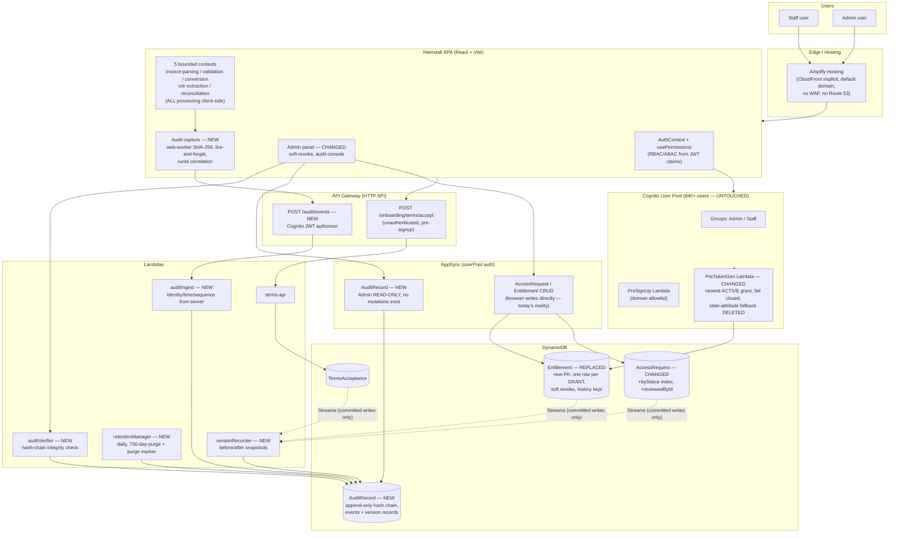

# Heimdall — Architecture & Data ERD (Single Source of Truth)

One picture for architecture, one for data. Everything marked `NEW` is the audit feature; everything marked `CHANGED` is an existing piece that must be modified. Unmarked = exists today and stays as is.

---

## 1. Your diagram vs. the actual repository

Reviewed against `amplify/backend.ts`, `amplify/data/resource.ts`, the auth triggers, and `src/`. These are the gaps:

| Your diagram says | The repository says |
|---|---|
| Route 53 → CloudFront → WAF | App runs on the default Amplify domain (`main.d3p8snpek9jhao.amplifyapp.com`). CloudFront is inside Amplify Hosting implicitly; there is **no Route 53 custom domain and no WAF** configured |
| API Gateway → `AccessRequestService` / `AdminApprovalService` Lambdas | **These Lambdas do not exist.** Access requests and approvals go **browser → AppSync** directly via `generateClient<Schema>()`. The only API Gateway route today is `POST /onboarding/terms/accept` |
| `AccessGrants` table | Named `Entitlement` in the schema |
| "Query by userId", "Query by status=PENDING" | **No index exists on either table.** The Admin panel does an unfiltered Scan and filters in JavaScript |
| CloudTrail records table events | Data events are not enabled, and CloudTrail can never see what matters here: all invoice processing happens **in the browser**, invisible to any AWS API log. That gap is the reason the audit feature exists |
| — (absent) | `TermsAcceptance` table + `terms-api` Lambda on an unauthenticated route are missing from your diagram |

**One direction question your diagram raises:** it routes request/approval through server-side Lambdas behind API Gateway. Today that logic runs in the browser. The audit design works under **both** (version capture is via DynamoDB Streams, which sees every writer), but if you intend to move approval server-side, say so before tasks are generated — soft-revoke logic would then live in a Lambda instead of `AdminPanel.tsx`.

---

## 2. Architecture — current + audit additions



**Trust rule in one line:** the browser reports *what* happened (file facts, run results); the server stamps *who* and *when* (verified JWT claims, server clock, sequence). No client credential can write, update, or delete an audit record — enforced by IAM, not by convention.

---

## 3. Data ERD — future state

`PK` partition key · `SK` sort key · `FK` logical reference (DynamoDB enforces nothing; the GSI is what makes it queryable) · join key everywhere = Cognito `sub` (immutable). Email is display-only, never joined.

```mermaid
erDiagram
    COGNITO_USER {
        string sub PK "immutable - THE join key"
        string email "mutable - display only"
        string groups "Admin or Staff"
    }

    ACCESS_REQUEST {
        string id PK
        string userId FK "sub of requester"
        string country ""
        string_array requestedFeatures ""
        string status "GSI byStatus - PENDING/APPROVED/REJECTED"
        string createdAt "GSI-SK byStatus"
        string reviewedById FK "NEW - sub of reviewing Admin"
        string reviewedByEmail "NEW - display"
    }

    ENTITLEMENT {
        string id PK "NEW - one row per GRANT (was one per user)"
        string userId FK "GSI byUser - sub"
        string country ""
        string_array allowedFeatures ""
        string status "ACTIVE or REVOKED - max 1 ACTIVE per user"
        string grantedById FK "sub of granting Admin"
        string grantedAt "GSI-SK byUser"
        string revokedById FK "NEW"
        string revokedAt "NEW"
        string supersededByGrantId FK "NEW - self-ref grant chain"
    }

    TERMS_ACCEPTANCE {
        string id PK
        string termsVersion ""
        string sessionId "pre-auth - no user link exists"
        string acceptedAt ""
    }

    AUDIT_RECORD {
        string chainPartition PK "MAIN"
        number sequenceNumber SK "contiguous 1..n"
        string auditId "stable identity"
        string recordType "AUDIT_EVENT or VERSION_RECORD"
        string runId FK "GSI byRunId - one interaction"
        string causationId FK "auditId of predecessor event"
        string actorId FK "sub or UNATTRIBUTED"
        string actorEmail "GSI byActorEmail - display"
        string recordedAt "server clock - authoritative"
        string featureKey "GSI byFeatureKey"
        string runStatus "GSI byRunStatus"
        string contentHash "file identity - NOT a join key"
        string modelRecordKey "GSI byModelRecord - model#id"
        number versionNumber "GSI-SK byModelRecord"
        map beforeSnapshot ""
        map afterSnapshot ""
        string chainDigest "SHA-256 tamper evidence"
        string prevChainDigest FK "= predecessor chainDigest"
    }

    COGNITO_USER ||--o{ ACCESS_REQUEST : "sub = userId"
    COGNITO_USER ||--o{ ENTITLEMENT : "sub = userId (max 1 ACTIVE)"
    COGNITO_USER ||--o{ AUDIT_RECORD : "sub = actorId"
    ACCESS_REQUEST ||--o| ENTITLEMENT : "approval copies userId + features"
    ENTITLEMENT |o--o| ENTITLEMENT : "supersededByGrantId = id"
    ACCESS_REQUEST ||--o{ AUDIT_RECORD : "modelRecordKey"
    ENTITLEMENT ||--o{ AUDIT_RECORD : "modelRecordKey"
    TERMS_ACCEPTANCE ||--o{ AUDIT_RECORD : "modelRecordKey"
    AUDIT_RECORD |o--o| AUDIT_RECORD : "runId groups / causationId chains"
```

---

## 4. What changes, who owns it, user impact (840+ users)

| Owner | Change | Impact on the 840 users |
|---|---|---|
| Cognito User Pool | **Nothing.** No accounts, groups, passwords, or sessions touched | None |
| PreTokenGen Lambda | Newest-ACTIVE-grant query; delete stale-attribute fallback; scoped IAM | Logins get *faster* (table-discovery scan removed). Revoked users can no longer regain stale claims |
| DynamoDB `Entitlement` | **Table replaced** (PK change). Export → deploy → re-import → seed history | The one risky step. If schema + Lambda don't ship together, logins resolve to empty entitlements until re-import completes. Ship as one deployment, off-hours, export verified first. Issued tokens stay valid until normal expiry |
| DynamoDB `AccessRequest` | Additive: `byStatus` index + actor attributes. Online backfill, no downtime | None |
| DynamoDB `AuditRecord` | New table | None |
| API Gateway + Lambdas | New authenticated route + 4 new functions | None — capture is fire-and-forget, never blocks a user |
| SPA | Capture hooks (1 line per site), soft-revoke, audit console tab | None visible to Staff; Admins get the audit console |

## 5. Decisions still open (blocking tasks)

1. Requirements criteria 2.1 / 2.2 / 2.7 still say "link by content hash" — design now uses `runId`. Needs your approval to amend.
2. Entitlement lookup: composite key (strongly consistent, recommended) vs. GSI (sub-second stale-claim window on revoke).
3. Keep the synchronous hash chain (recommended; ~10 ms server-side, ceiling ≫ your load) vs. checkpoint digests.
4. Your target diagram's server-side approval Lambdas: adopt now, or keep browser → AppSync writes (audit works either way)?
