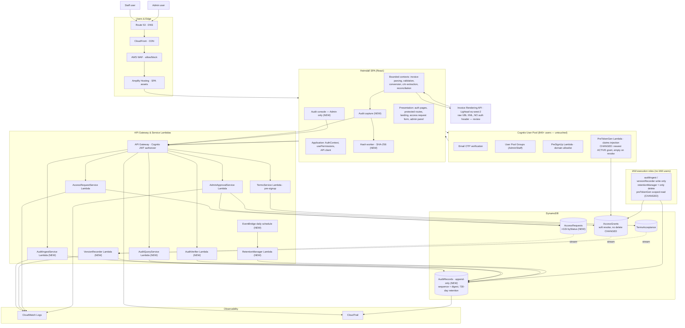

# Heimdall — Architecture & Data Schema (Mermaid)

Renders in Kiro / VS Code markdown preview (open this file, then open preview). No external tool needed.
`(NEW)` = audit-trail addition · `CHANGED` = existing piece modified · numbered flows ①–⑨ match the sections below.

---

## 1. Cloud Architecture



### Numbered flows
1. **Hosting** — Users → Route 53 → WAF/CloudFront → Amplify → SPA
2. **Terms** — SPA → API GW → TermsService → TermsAcceptance (unauthenticated, pre-signup)
3. **Auth** — SPA ↔ Cognito (OTP, JWT); PreSignUp allowlist
4. **Claims** — PreTokenGen reads newest ACTIVE grant → JWT claims *(CHANGED: empty on revoke, stale fallback deleted)*
5. **Requests/Approval** — SPA → API GW → AccessRequest/AdminApproval → DynamoDB *(soft revoke, never delete)*
6. **Audit capture** — features → capture → hash worker → `/audit/events` → AuditIngest → AuditRecords
7. **Versioning** — DynamoDB Streams → VersionRecorder → AuditRecords (covers every writer)
8. **Read/verify/retention** — console → API GW → AuditQuery / AuditVerifier; EventBridge → RetentionManager
9. **PDF (risk)** — invoice-conversion → Lightsail `/generate-pdf`, **raw XML, no auth header**

---

## 2. Data Schema (ERD)

`PK` partition key · `SK` sort key · `FK` logical reference (a GSI makes it queryable; DynamoDB enforces nothing).
Join key everywhere = Cognito `sub` (immutable). `*Email` attributes are display-only, never joined.

```mermaid
erDiagram
    COGNITO_USER ||--o{ ACCESS_REQUEST : "sub = userId (subject)"
    COGNITO_USER ||--o{ ACCESS_REQUEST : "sub = reviewedById (actor NEW)"
    COGNITO_USER ||--o{ ENTITLEMENT : "sub = userId (max 1 ACTIVE)"
    COGNITO_USER ||--o{ ENTITLEMENT : "sub = grantedById/revokedById"
    COGNITO_USER ||--o{ AUDIT_RECORD : "sub = actorId"
    ACCESS_REQUEST ||--o| ENTITLEMENT : "approval copies userId+features"
    ENTITLEMENT |o--o| ENTITLEMENT : "supersededByGrantId = id"
    ACCESS_REQUEST ||--o{ AUDIT_RECORD : "modelRecordKey"
    ENTITLEMENT ||--o{ AUDIT_RECORD : "modelRecordKey"
    TERMS_ACCEPTANCE ||--o{ AUDIT_RECORD : "modelRecordKey"
    AUDIT_RECORD |o--o| AUDIT_RECORD : "causationId / prevChainDigest"

    COGNITO_USER {
        string sub PK "immutable — THE join key"
        string email "mutable — display only"
        string groups "Admin or Staff"
    }

    ACCESS_REQUEST {
        string id PK
        string userId FK "requester sub"
        string email "display"
        string fullName "display"
        string country "ISO codes"
        string requestedFeatures "feature keys"
        string status "GSI byStatus (NEW)"
        string createdAt "GSI-SK byStatus"
        string reviewedById FK "Admin sub (NEW)"
        string reviewedByEmail "display (NEW)"
        string reviewedAt "timestamp"
    }

    ENTITLEMENT {
        string id PK "one row per GRANT (was per user)"
        string userId FK "GSI byUser — sub"
        string country "ISO codes"
        string allowedFeatures "feature keys"
        string status "ACTIVE or REVOKED"
        string grantedById FK "granting Admin sub"
        string grantedByEmail "display"
        string grantedAt "GSI-SK byUser"
        string revokedById FK "NEW"
        string revokedByEmail "display NEW"
        string revokedAt "validity end NEW"
        string supersededByGrantId FK "grant chain NEW"
    }

    TERMS_ACCEPTANCE {
        string id PK
        string termsVersion "version"
        string sessionId "pre-auth, no user link"
        string acceptedAt "timestamp"
    }

    AUDIT_RECORD {
        string chainPartition PK "MAIN"
        number sequenceNumber SK "contiguous 1..n, gap = deletion"
        string auditId "stable identity"
        string recordType "AUDIT_EVENT or VERSION_RECORD"
        string runId FK "GSI byRunId — one interaction"
        string causationId FK "predecessor auditId"
        string actorId FK "sub or UNATTRIBUTED"
        string actorEmail "GSI byActorEmail"
        string recordedAt "server clock — authoritative"
        string clientReportedAt "untrusted browser clock"
        number expiresAt "recordedAt + 730 days"
        string action "FILE_SUBMITTED, RUN_COMPLETED, etc"
        string featureKey "GSI byFeatureKey"
        string runStatus "GSI byRunStatus"
        string contentHash "file identity — NOT a join key"
        string modelRecordKey "GSI byModelRecord"
        number versionNumber "GSI-SK byModelRecord"
        json beforeSnapshot "empty at v1"
        json afterSnapshot "post-change image"
        string chainDigest "SHA-256 tamper evidence"
        string prevChainDigest FK "= predecessor chainDigest"
    }
```

### GSI summary (not expressible in ERD lines)
| Table | Index | PK | SK | Serves |
|---|---|---|---|---|
| AccessRequests | byStatus (NEW) | status | createdAt | Admin panel — removes the Scan |
| Entitlement | byUser (NEW) | userId | grantedAt | Login reads newest ACTIVE grant |
| AuditRecords | byActorEmail | actorEmail | recordedAt | Console filter by user + date |
| AuditRecords | byFeatureKey | featureKey | recordedAt | Filter by feature |
| AuditRecords | byRunStatus | runStatus | recordedAt | Filter by SUCCESS/PARTIAL/FAILED |
| AuditRecords | byModelRecord | modelRecordKey | versionNumber | Version history + next version |
| AuditRecords | byRunId | runId | recordedAt | Whole interaction in one query |
